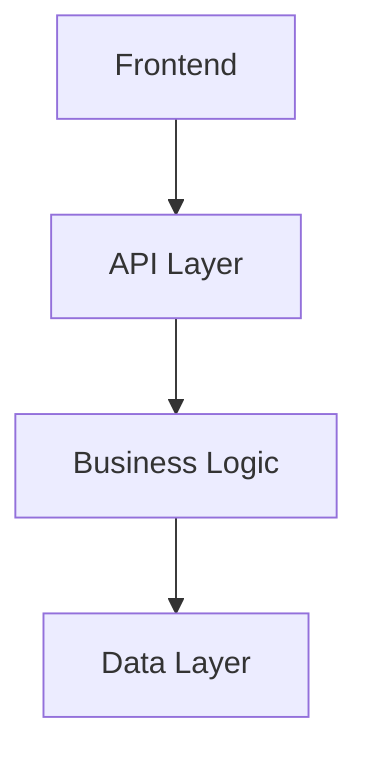

## Context

- Specification document: Will be detected from project directory
- Requirements document: Will be detected from project directory

## Your task

### 1. Detect project directory and verify prerequisites

**Step 1: Determine current project context**

```bash
pwd
```

**Step 2: Apply project detection logic (same as previous steps)**

```bash
# Get absolute path and normalize
REALPATH=$(realpath .)
echo "Current absolute path: $REALPATH"
```

- If current directory path contains `/apps/[project-name]` → Set PROJECT_DIR to current app directory
- If current directory basename is an app name under apps/ → Set PROJECT_DIR to current directory
- If in apps/ subdirectory → Use current app directory
- Default to current directory (assumed to be within apps/)

**Step 3: Verify prerequisite documents exist**

- Check that `.tmp/step-1-specification.md` exists
- Check that `.tmp/step-2-requirements.md` exists
- If either missing, inform user to complete previous steps first
- Confirm project context: "Creating system design for current app project"

### 2. Analyze requirements

Read and understand the specification and requirements documents thoroughly

### 3. Analyze existing project assets

#### 3.1 Check existing architecture

- Analyze monorepo structure (current app, ../../packages/)
- Check existing data models and API structures
- Document current system architecture

#### 3.2 Check code quality tools configuration

- Read `eslint.config.mjs` and shared configs in `../../packages/eslint-config/`
- Read `prettier.config.mjs` and shared configs in `../../packages/prettier-config/`
- Run `pnpm lint` to verify linting setup
- Document any custom rules or exceptions

### 4. Create System Design Document

**Use the Write tool to create `.tmp/step-3-system-design.md` with the following content:**

````markdown
# システム設計書 - [タスク名]

## 1. システムアーキテクチャ

### 1.1 アーキテクチャ概要

[システム全体のアーキテクチャパターンと構成]

### 1.2 技術スタック

- 言語: [使用言語とバージョン]
- フレームワーク: [使用フレームワーク]
- データベース: [DB 種類とバージョン]
- インフラ: [インフラ構成]
- ツール: [ビルドツール、テストツールなど]

### 1.3 システム構成図


````

## 2. データ設計

### 2.1 データモデル

#### [Entity1]

```typescript
interface Entity1 {
  id: string;
  name: string;
  createdAt: Date;
  updatedAt: Date;
}
```

### 2.2 データフロー

[データの流れと変換プロセス]

### 2.3 データベース設計

- テーブル設計
- インデックス戦略
- パフォーマンス考慮事項

## 3. API 設計

### 3.1 API 仕様

#### [API1] - [目的]

```typescript
// Request
interface RequestType {
  param1: string;
  param2: number;
}

// Response
interface ResponseType {
  result: string;
  data: any[];
}
```

### 3.2 認証・認可

[認証方式とアクセス制御]

### 3.3 エラーハンドリング

[API エラーの分類と対応]

## 4. セキュリティ設計

### 4.1 セキュリティ要件

- データ保護
- アクセス制御
- 入力検証

### 4.2 セキュリティ対策

[具体的なセキュリティ実装方針]

## 5. パフォーマンス設計

### 5.1 パフォーマンス要件

- 応答時間目標
- スループット目標
- 同時接続数

### 5.2 最適化戦略

[パフォーマンス最適化のアプローチ]

## 6. 可用性・運用設計

### 6.1 可用性要件

- アップタイム目標
- 障害許容度

### 6.2 運用・監視

- ログ戦略
- モニタリング方針
- アラート設定

## 7. テスト戦略

### 7.1 テスト方針

- 単体テスト戦略
- 統合テスト戦略
- E2E テスト戦略

### 7.2 品質保証

- コード品質基準
- テストカバレッジ目標

## 8. デプロイメント設計

### 8.1 CI/CD パイプライン

[ビルド・デプロイフロー]

### 8.2 環境管理

- 開発環境
- ステージング環境
- 本番環境

## 9. monorepo 統合

### 9.1 パッケージ構成

- current app - アプリケーション固有の実装
- `packages/` - 共有ライブラリとの連携

### 9.2 依存関係管理

[monorepo 内での依存関係とバージョン管理]

```

### 5. Update TODO

Use TodoWrite to add "システム設計の完了とレビュー" as a task

### 6. Present to user

Show the created system design document and ask for:

- Technical architecture feedback
- Security and performance approval
- Permission to proceed to UI design phase

## Important Notes

- Focus on technical architecture and system-level design
- Avoid UI/UX details (those belong in Step 4)
- Include concrete interface definitions
- Address all technical requirements from requirements document
- Consider monorepo structure and existing technical assets
- **MUST ensure all code passes ESLint and Prettier checks**
- **Use pnpm as the package manager for all commands and documentation**
```
