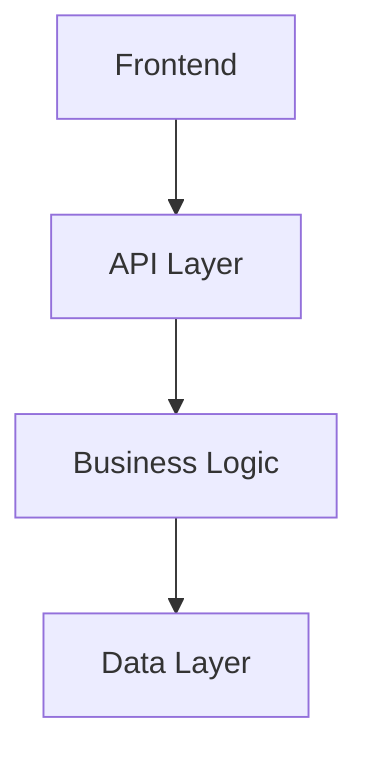

## Context

- Task description: $ARGUMENTS
- Working directory: Current app directory (auto-detected)
- Specification document: @.tmp/step-1-specification.md
- Requirements document: @.tmp/step-2-requirements.md

## Your task

### 1. Setup and verify prerequisites

- **Execute**: `mkdir -p .tmp` to create the temporary directory if it doesn't exist
- Check that `.tmp/step-1-specification.md` exists
- Check that `.tmp/step-2-requirements.md` exists
- If either missing, inform user to complete previous steps first

```bash
mkdir -p .tmp
```

### 2. Analyze requirements

Read and understand the specification and requirements documents thoroughly

### 3. Analyze existing project assets

#### 3.1 Check monorepo structure

- Use list_dir to check monorepo structure (apps/web/, packages/)
- Check existing data models and API structures
- Document current system architecture

#### 3.2 Check existing components

- Use file_search to find components in `packages/ui/src/`
- Read key components to understand their interfaces and usage patterns
- Document available UI components for system design consideration

#### 3.3 Check code quality tools configuration

- Read `eslint.config.mjs` and shared configs in `packages/eslint-config/`
- Read `prettier.config.mjs` and shared configs in `packages/prettier-config/`
- Read `tsconfig.json` and shared configs in `packages/typescript-config/`
- Verify `@package/ui` components import setup
- Check Tailwind CSS v4 configuration in `postcss.config.mjs`
- Run `pnpm lint` to verify linting setup
- Document any custom rules or exceptions

### 4. Create System Design Document

**Use the Write tool to create `.tmp/step-3-system-design.md` with the following content:**

````markdown
# システム設計書 - [タスク名]

## 1. システムアーキテクチャ

### 1.1 アーキテクチャ概要

[システム全体のアーキテクチャパターンと構成]

### 1.2 技術スタック

- **言語**: TypeScript 5, JavaScript ES2024
- **フレームワーク**: Next.js 15.4.4, React 19.1.0
- **スタイリング**: Tailwind CSS v4 (@tailwindcss/postcss)
- **UI ライブラリ**: Headless UI v2.2.0, Custom UI Components
- **モノレポ管理**: Turbo, pnpm 10.7.1
- **品質管理**: ESLint, Prettier, TypeScript
- **インフラ**: [プロジェクト固有のインフラ構成]
- **データベース**: [DB 種類とバージョン]

### 1.3 システム構成図


````

## 2. データ設計

### 2.1 データモデル

#### [Entity1]

```typescript
interface Entity1 {
  id: string;
  name: string;
  createdAt: Date;
  updatedAt: Date;
}
```

### 2.2 データフロー

[データの流れと変換プロセス]

### 2.3 データベース設計

- テーブル設計
- インデックス戦略
- パフォーマンス考慮事項

## 3. API 設計

### 3.1 API 仕様

#### [API1] - [目的]

```typescript
// Request
interface RequestType {
  param1: string;
  param2: number;
}

// Response
interface ResponseType {
  result: string;
  data: any[];
}
```

### 3.2 認証・認可

[認証方式とアクセス制御]

### 3.3 エラーハンドリング

[API エラーの分類と対応]

## 4. セキュリティ設計

### 4.1 セキュリティ要件

- データ保護
- アクセス制御
- 入力検証

### 4.2 セキュリティ対策

[具体的なセキュリティ実装方針]

## 5. パフォーマンス設計

### 5.1 パフォーマンス要件

- 応答時間目標
- スループット目標
- 同時接続数

### 5.2 最適化戦略

[パフォーマンス最適化のアプローチ]

## 6. 可用性・運用設計

### 6.1 可用性要件

- アップタイム目標
- 障害許容度

### 6.2 運用・監視

- ログ戦略
- モニタリング方針
- アラート設定

## 7. テスト戦略

### 7.1 テスト方針

- 単体テスト戦略
- 統合テスト戦略
- E2E テスト戦略

### 7.2 品質保証

- コード品質基準
- テストカバレッジ目標

## 8. デプロイメント設計

### 8.1 CI/CD パイプライン

[ビルド・デプロイフロー]

### 8.2 環境管理

- 開発環境
- ステージング環境
- 本番環境

## 9. monorepo 統合

### 9.1 パッケージ構成

- **apps/web/**: Next.js 15.4.4 メインアプリケーション
- **packages/ui/**: 共有 UI コンポーネントライブラリ (Headless UI ベース)
- **packages/eslint-config/**: ESLint 設定 (base, next, react, typescript)
- **packages/prettier-config/**: Prettier 設定 (base, tailwind)
- **packages/typescript-config/**: TypeScript 設定 (base, nextjs, react)

### 9.2 依存関係管理

#### Package Management Strategy

- **パッケージマネージャー**: pnpm 10.7.1 with workspace support
- **Workspace Protocol**: `workspace:*` で内部パッケージの最新バージョン参照
- **Dependency Hoisting**: pnpm の効率的な node_modules 管理

#### Internal Dependencies (workspace:\*)

```json
// apps/web/package.json での内部依存例
{
  "dependencies": {
    "@package/ui": "workspace:*",
    "@package/eslint-config": "workspace:*",
    "@package/prettier-config": "workspace:*",
    "@package/typescript-config": "workspace:*"
  }
}
```

#### External Dependencies

- **Core**: next@15.4.4, react@19.1.0, typescript@5.8.3
- **UI**: @headlessui/react@2.2.0, clsx (utility)
- **Styling**: @tailwindcss/postcss, tailwindcss@4.x
- **Development**: eslint@9.25.1, prettier@3.5.3, turbo@2.5.2

#### Build Optimization

- **Turbo**: 並列ビルドと依存関係最適化
- **Cache Strategy**: Turbo による効率的なキャッシュ管理
- **Pipeline**: lint → typecheck → build の順序保証

### 9.3 コンポーネント設計指針

#### Shared Components (@package/ui) - 第1優先使用

**基本方針**: 全てのコンポーネント実装で `@package/ui` を最優先で使用

- **Target**: 汎用的で再利用可能なコンポーネント
- **Base**: Headless UI v2.2.0 コンポーネントをラップ
- **Styling**: Tailwind CSS v4 ユーティリティクラスで完全スタイリング済み
- **Props**: TypeScript による型安全なprops定義
- **Accessibility**: Headless UI による完全なa11y対応
- **Coverage**: 28 コンポーネントカテゴリ (基本要素から複雑なUIまで全てカバー)

#### App-Specific Components (apps/web/src/) - 最終手段のみ

**作成条件**: `@package/ui` に必要なコンポーネントが存在しない場合のみ

- **Target**: アプリ固有のビジネスロジックを含むコンポーネント
- **Composition**: @package/ui コンポーネントを組み合わせた複合コンポーネント
- **Business Logic**: 特定のドメインに特化した機能
- **Page Components**: page.tsx, layout.tsx など
- **作成前チェック**: 必ず `packages/ui/src/index.ts` で既存コンポーネントを確認

#### Import Strategy - 必須手順

**Step 1: 必ず @package/ui を最初にチェック**

```typescript
// 第1優先: @package/ui からの Named imports
import {
  Button,
  Table,
  TableHead,
  TableBody,
  TableRow,
  TableCell,
  Input,
  Dialog,
  Alert,
} from "@package/ui";
```

**Step 2: 無い場合のみアプリ固有コンポーネント**

```typescript
// 最終手段: アプリ固有コンポーネント (必要最小限のみ)
import { CustomBusinessComponent } from "@/components/CustomBusinessComponent";
```

**実装チェックリスト**:

1. `packages/ui/src/index.ts` で必要なコンポーネントを検索
2. 機能的に使えるコンポーネントがあるか確認
3. 無い場合のみ新規作成を検討
4. 汎用性がある場合は `packages/ui/` への追加を優先検討

#### Component Color System

- **Button**: 20+ color variants (red, blue, green, etc.) + outline/plain modes
- **Badge**: Full color palette with hover states
- **Checkbox/Radio/Switch**: Matching color system across form elements
- **Alert**: Semantic color mapping (success, warning, error, info)

### 9.4 Development Workflow Integration

#### Quality Gates + Component Check

```bash
# コンポーネント実装時の必須手順
# 1. @package/ui コンポーネント確認
cat packages/ui/src/index.ts

# 2. 品質チェックフロー
pnpm format        # Prettier による自動整形
pnpm lint:fix      # ESLint エラー自動修正
pnpm lint          # ESLint チェック (0 errors required)
pnpm typecheck     # TypeScript 型チェック
pnpm build         # Next.js ビルド検証

# 3. コンポーネント使用験証
grep -r "@package/ui" apps/web/src  # @package/ui 使用確認
```

#### Monorepo Commands

```bash
# ルートでの操作
pnpm install              # 全パッケージ依存関係インストール
pnpm build                # Turbo による最適化ビルド
pnpm lint                 # 全パッケージ lint チェック

# 特定アプリでの操作
cd apps/web
pnpm dev                  # 開発サーバー起動
pnpm build                # アプリ単体ビルド
```

#### Package Development

```bash
# UI コンポーネント開発
cd packages/ui
pnpm build                # コンポーネントライブラリビルド

# 設定パッケージ更新
cd packages/eslint-config
# 設定変更後、依存アプリで自動反映
```

```

### 5. Create TODO entry

Use TodoWrite to add "システム設計の完了とレビュー" as a task

### 6. Present to user

Show the created system design document and ask for:

- Technical architecture feedback
- Security and performance approval
- Permission to proceed to UI design phase

## Important Notes

- Focus on technical architecture and system-level design
- Avoid UI/UX details (those belong in Step 4)
- Include concrete interface definitions
- Address all technical requirements from requirements document
- Consider monorepo structure and existing technical assets
- **MUST ensure all code passes ESLint, Prettier, and TypeScript checks**
- **MUST use Tailwind CSS v4 utility classes only**
- **MUST leverage existing UI components from packages/ui/**
- **Use pnpm as the package manager for all commands and documentation**
```
