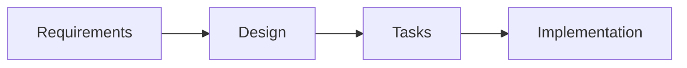

# Project Guidelines

This document defines the project's development standards, methodology, and best practices. Adhere to these guidelines strictly for consistent, high-quality code.

## 🎯 Core Principles

### Execution Strategy

- **Parallel Processing**: Execute independent operations concurrently for maximum efficiency
- **Language Policy**: Think in English, respond in Japanese
- **Library Documentation**: Use Context7 MCP for latest library information
- **File Organization**: Use `.tmp` directory for temporary documentation
- **Verification Protocol**: Always verify file contents after modifications
- **Communication Style**: Provide honest, constructive feedback professionally

## 💻 Development Standards

### TypeScript Guidelines

```typescript
// ❌ Avoid
const data: any = fetchData();
const result: unknown = processData();
class UserService {} // Avoid classes unless necessary

// ✅ Prefer
const data: UserData = fetchData();
const result: ProcessedResult = processData();
const userService = {}; // Use objects/functions
```

### Component Development

1. **Priority**: Always check `@package/ui` first
2. **Custom Components**: Create only when necessary
3. **Mock Data**: Implement features with mock data before external integration

### Code Quality Rules

- No hard-coded values (use constants/config)
- No `any` or `unknown` types
- Avoid classes (except for Error extensions)
- Use functional programming patterns
- Implement proper error handling

## 🔍 Quality Assurance Process

### Phase 1: Auto-fix (Sequential)

```bash
pnpm install      # Install dependencies
pnpm lint:fix     # Auto-fix linting issues
pnpm format       # Format code
```

### Phase 2: Verification (Parallel)

**macOS/Linux:**

```bash
pnpm lint & pnpm typecheck & pnpm build
```

**Windows:**

```powershell
pnpm lint; pnpm typecheck; pnpm build
```

### Completion Criteria

- ✅ All linting rules pass
- ✅ No TypeScript errors
- ✅ Build succeeds
- ✅ Tests pass (if applicable)

## 📋 Specification-Driven Development

### Workflow Overview



### Stage Details

#### 1️⃣ Requirements Analysis

- Analyze user needs
- Document in `.tmp/step-1-requirements.md`
- Command: `/step-1-requirements`

#### 2️⃣ Technical Design

- Create technical specifications
- Document in `.tmp/step-2-design.md`
- Command: `/step-2-design`

#### 3️⃣ Task Planning

- Break down into implementable units
- Document in `.tmp/step-3-tasks.md`
- Command: `/step-3-tasks`
- Use TodoWrite for task tracking

#### 4️⃣ Implementation (Post-Workflow)

- Execute tasks systematically using TodoWrite tracking
- Update task status in real-time during development
- Run quality checks per task completion
- Maintain parallel processing for independent operations

### Available Commands

| Command                | Description       | When to Use        |
| ---------------------- | ----------------- | ------------------ |
| `/full-automatic`      | Complete workflow | New features       |
| `/step-1-requirements` | Requirements only | Initial analysis   |
| `/step-2-design`       | Design only       | After requirements |
| `/step-3-tasks`        | Task breakdown    | After design       |

## 🚀 Best Practices

### Development Patterns

#### Parallel Tool Usage

```javascript
// ✅ Efficient: Parallel execution
Promise.all([
  readFile("config.json"),
  readFile("data.json"),
  searchPattern("TODO"),
]);

// ❌ Inefficient: Sequential execution
await readFile("config.json");
await readFile("data.json");
await searchPattern("TODO");
```

#### Component Architecture

```typescript
// ✅ Modular, testable components
interface ButtonProps {
  variant: "primary" | "secondary";
  onClick: () => void;
  children: React.ReactNode;
}

export const Button: React.FC<ButtonProps> = ({
  variant,
  onClick,
  children,
}) => {
  // Implementation
};
```

#### TodoWrite Task Management

```javascript
// ✅ Effective task tracking
{
  "merge": false,
  "todos": [
    {
      "id": "setup-auth",
      "content": "Setup authentication system with JWT",
      "status": "in_progress"
    },
    {
      "id": "create-login",
      "content": "Create login form component",
      "status": "pending"
    }
  ]
}
```

**Best Practices:**

- Only ONE task `in_progress` at a time
- Update status immediately after completion
- Use descriptive, actionable task names
- Break complex tasks into smaller units
- Track dependencies between tasks

### Performance Optimization

- Implement code splitting
- Use lazy loading for routes
- Optimize bundle size
- Cache API responses
- Implement virtual scrolling for large lists

### Error Handling

```typescript
// ✅ Comprehensive error handling
try {
  const data = await fetchData();
  return processData(data);
} catch (error) {
  if (error instanceof NetworkError) {
    return handleNetworkError(error);
  }
  if (error instanceof ValidationError) {
    return handleValidationError(error);
  }
  throw new UnexpectedError("予期しないエラーが発生しました", { cause: error });
}
```

## 📦 Dependency Management

### Adding Dependencies

```bash
# Production dependency
pnpm add package-name

# Development dependency
pnpm add -D package-name

# Specific version
pnpm add package-name@1.2.3
```

### Resolution Process

1. **Identify missing packages** from errors
2. **Use Context7 MCP** to get latest library documentation
3. **Check alternatives** in `@package/ui` first
4. **Add required dependencies** with specific versions
5. **Run quality checks** (lint → typecheck → build)
6. **Update documentation** if needed

### MCP Context7 Integration

```bash
# Get latest library information
mcp__context7__resolve-library-id "react-query"
mcp__context7__get-library-docs "react-query@5.0.0"
```

Benefits:

- Always use latest library patterns
- Access to current best practices
- Avoid deprecated methods
- Get accurate type definitions

## 🎨 UI/UX Guidelines

### Design Principles

- **Responsive**: Mobile-first approach
- **Accessible**: WCAG 2.1 compliance
- **Performance**: Sub-3s load times
- **Consistent**: Use design system tokens

### Interactive Elements

- Hover states with smooth transitions
- Loading states for async operations
- Error states with recovery actions
- Empty states with clear CTAs
- Micro-interactions for feedback

### Animation Guidelines

```css
/* ✅ Smooth, purposeful animations */
.button {
  transition: all 0.2s ease-in-out;
}

.modal {
  animation: slideIn 0.3s cubic-bezier(0.68, -0.55, 0.265, 1.55);
}
```

## 🔧 Debugging & Troubleshooting

### Common Issues

| Issue          | Solution                               |
| -------------- | -------------------------------------- |
| Type errors    | Check tsconfig.json, verify imports    |
| Build failures | Clear cache, reinstall dependencies    |
| Lint errors    | Run `pnpm lint:fix` first              |
| Test failures  | Check mock data, verify async handling |

### Debug Commands

```bash
# Clear all caches
pnpm clean

# Reinstall dependencies
rm -rf node_modules pnpm-lock.yaml && pnpm install

# Check for outdated packages
pnpm outdated

# Analyze bundle size
pnpm analyze

# Complete quality check pipeline
pnpm install && pnpm lint:fix && pnpm format
pnpm lint && pnpm typecheck && pnpm build
```

### Permission Management

Claude Code permissions are managed via `.claude/settings.json`:

**Allowed Operations:**

- File operations (`Read`, `Write`, `Edit`, `MultiEdit`)
- Git operations (status, add, commit, branch)
- pnpm package management
- TodoWrite task tracking
- MCP Context7 library documentation

**Restricted Operations:**

- System-level commands (`sudo`, `chmod`)
- Destructive operations (`rm -rf`)
- Network operations (`curl`, `wget`)
- Sensitive file access (`.env`, `.key` files)

## 📚 Additional Resources

- [Next.js Documentation](https://nextjs.org/docs)
- [TypeScript Handbook](https://www.typescriptlang.org/docs/)
- [Tailwind CSS Docs](https://tailwindcss.com/docs)
- [React Best Practices](https://react.dev/learn)

---

**Remember**: Quality over quantity. Write code that you'll be proud to maintain.
