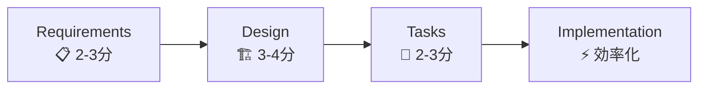

# Project Guidelines

プロジェクトの開発標準、方法論、ベストプラクティスを定義します。一貫性のある高品質なコードのため、これらのガイドラインを厳密に遵守してください。

## 🎯 Core Principles

- **並列処理**: 独立した操作を同時実行して効率を最大化
- **コンテキスト管理**: 集中的なコンテキストウィンドウを維持
- **言語ポリシー**: 英語で思考し、日本語で回答
- **ファイル組織**: `.tmp`ディレクトリで一時ドキュメント管理
- **検証プロトコル**: 変更後は必ずファイル内容を確認
- **エラー回復**: 包括的なエラーハンドリングと回復戦略

## 📁 Project Structure

### モノレポ構成

```
shunsaku-monorepo/
├── apps/
│   └── web/                    # メインアプリケーション
│       ├── src/
│       │   └── app/           # Next.js App Router
│       │       ├── layout.tsx # ルートレイアウト
│       │       ├── page.tsx   # ホームページ
│       │       └── globals.css # グローバルスタイル
│       ├── .claude/           # Specification-Driven Development
│       │   ├── CLAUDE.md      # プロジェクトガイドライン
│       │   ├── settings.json  # Claude設定
│       │   └── commands/      # SDD コマンド群
│       ├── .tmp/              # 仕様書生成ディレクトリ
│       ├── public/            # 静的ファイル
│       ├── package.json       # アプリ依存関係
│       ├── tsconfig.json      # TypeScript設定
│       ├── next.config.ts     # Next.js設定
│       └── eslint.config.mjs  # ESLint設定
└── packages/                  # 共有ライブラリ
    ├── ui/                    # UIコンポーネントライブラリ
    ├── eslint-config/         # ESLint共通設定
    ├── prettier-config/       # Prettier共通設定
    └── typescript-config/     # TypeScript共通設定
```

### 開発ディレクトリ

- **`src/app/`**: Next.js 15 App Router（ページ・レイアウト）
- **`.claude/`**: 仕様駆動開発環境（コマンド・設定）
- **`.tmp/`**: 自動生成仕様書（requirements・design・tasks）
- **`@package/ui`**: 28種類のUIコンポーネント統合済み

### 重要な設定ファイル

| ファイル              | 役割                 | 説明                         |
| --------------------- | -------------------- | ---------------------------- |
| `package.json`        | 依存関係・スクリプト | 品質保証コマンド追加済み     |
| `tsconfig.json`       | TypeScript設定       | `@/*`パスエイリアス設定      |
| `next.config.ts`      | Next.js設定          | Turbopack・最適化設定        |
| `globals.css`         | グローバルスタイル   | @package/ui・Tailwind統合    |
| `eslint.config.mjs`   | コード品質           | @package/eslint-config使用   |
| `prettier.config.mjs` | フォーマット         | @package/prettier-config使用 |

### Packagesライブラリ

| Package                      | 目的             | 提供機能                    |
| ---------------------------- | ---------------- | --------------------------- |
| `@package/ui`                | UIコンポーネント | 再利用可能コンポーネント    |
| `@package/eslint-config`     | コード品質       | Next.js特化ESLintルール     |
| `@package/prettier-config`   | フォーマット     | Tailwind対応Prettier設定    |
| `@package/typescript-config` | 型チェック       | Next.js最適化TypeScript設定 |

## 💻 Development Standards

### TypeScript Guidelines

- **型安全性**: `any`、`unknown`型を避け、適切な型定義を使用
- **関数型アプローチ**: クラスではなくオブジェクト/関数を優先
- **エラーハンドリング**: 包括的なエラー処理を実装

### Component Development

1. **@package/ui優先**: カスタムコンポーネント作成前に既存コンポーネントを確認
2. **モックデータ**: 外部統合前にモックデータで機能実装

### Quality Assurance Process

```bash
# 自動修正
pnpm install
pnpm lint:fix
pnpm format

# 検証（順次実行）
pnpm lint
pnpm typecheck
pnpm build
```

## 📋 Specification-Driven Development

### Workflow (7-10分で完全仕様書生成)



### Available Commands

| Command                | Description                            | Output                            |
| ---------------------- | -------------------------------------- | --------------------------------- |
| `/full-automatic`      | Requirements → Design → Tasks 一括実行 | 完全仕様書セット                  |
| `/step-1-requirements` | SMART+原則で要件定義                   | `.tmp/step-1-requirements.md`     |
| `/step-2-design`       | SOLID原則で技術仕様                    | `.tmp/step-2-design.md`           |
| `/step-3-tasks`        | INVEST原則でタスク分解                 | `.tmp/step-3-tasks.md` + TodoList |

### エラーハンドリング

```bash
# ロールバック手順
rm -rf .tmp/step-*
/full-automatic "詳細で明確な要求説明"
```

## 🚀 Best Practices

### Development Patterns

- **並列実行**: Promise.all()で独立操作を同時実行
- **モジュラー設計**: 再利用可能で テスト可能なコンポーネント
- **型安全性**: 適切なinterface定義とTypeScript活用

### TodoWrite Task Management

- 同時に`in_progress`のタスクは1つのみ
- 完了後は即座にステータス更新
- 具体的で実行可能なタスク名を使用

### Performance & Error Handling

- コード分割、遅延読み込み、バンドル最適化
- 包括的なエラーハンドリング（型別処理）

## 📦 Dependency Management

### パッケージ追加手順

1. **package.json直接編集** - 依存関係を手動追加
2. **pnpm install実行** - パッケージをインストール
3. **@package/ui優先確認** - 既存コンポーネントで代替可能か検討

## 🎨 UI/UX Guidelines

- **レスポンシブ**: モバイルファースト
- **アクセシビリティ**: WCAG 2.1準拠
- **パフォーマンス**: 3秒以下の読み込み時間
- **一貫性**: デザインシステムトークンを使用

## 🔧 Debugging & Troubleshooting

### Common Issues & Solutions

| Issue          | Solution                                 |
| -------------- | ---------------------------------------- |
| Type errors    | tsconfig.json確認、インポート検証        |
| Build failures | キャッシュクリア、依存関係再インストール |
| Lint errors    | `pnpm lint:fix`実行                      |

### Debug Commands

```bash
# キャッシュクリア & 再インストール
pnpm store prune
pnpm install

# 完全品質チェック
pnpm install
pnpm lint:fix
pnpm format
pnpm lint
pnpm typecheck
pnpm build
```

---

**Quality over quantity. 保守しやすい高品質なコードを心がける。**
