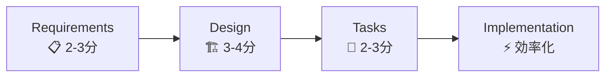

# Project Guidelines

This document defines the project's development standards, methodology, and best practices. Adhere to these guidelines strictly for consistent, high-quality code.

## 🎯 Core Principles

### Claude Code Best Practices Integration

- **Parallel Processing**: Execute independent operations concurrently for maximum efficiency
- **Context Management**: Use `/clear` command frequently to maintain focused context windows
- **Language Policy**: Think in English, respond in Japanese
- **Library Documentation**: Use Context7 MCP for latest library information
- **File Organization**: Use `.tmp` directory for temporary documentation (simple, human-readable)
- **Verification Protocol**: Always verify file contents after modifications
- **Communication Style**: Provide honest, constructive feedback professionally
- **Iterative Improvement**: Use feedback loops for continuous quality enhancement
- **Error Recovery**: Implement comprehensive error handling and rollback strategies

## 💻 Development Standards

### TypeScript Guidelines

```typescript
// ❌ Avoid
const data: any = fetchData();
const result: unknown = processData();
class UserService {} // Avoid classes unless necessary

// ✅ Prefer
const data: UserData = fetchData();
const result: ProcessedResult = processData();
const userService = {}; // Use objects/functions
```

### Component Development

1. **Priority**: Always check `@package/ui` first
2. **Custom Components**: Create only when necessary
3. **Mock Data**: Implement features with mock data before external integration

### Code Quality Rules

- No hard-coded values (use constants/config)
- No `any` or `unknown` types
- Avoid classes (except for Error extensions)
- Use functional programming patterns
- Implement proper error handling

## 🔍 Quality Assurance Process

### Phase 1: Auto-fix (Sequential)

```bash
pnpm install      # Install dependencies
pnpm lint:fix     # Auto-fix linting issues
pnpm format       # Format code
```

### Phase 2: Verification (Windows最適化)

**推奨方法 (全OS対応・確実性重視):**

```bash
# 順次実行 - Windows環境で確実に動作
pnpm lint
pnpm typecheck
pnpm build
```

**並列実行 (上級者向け):**

```bash
# macOS/Linux: バックグラウンド並列実行
pnpm lint & pnpm typecheck & pnpm build & wait

# Windows PowerShell: 個別実行推奨
pnpm lint
pnpm typecheck
pnpm build
```

### Completion Criteria

- ✅ All linting rules pass
- ✅ No TypeScript errors
- ✅ Build succeeds
- ✅ Tests pass (if applicable)

## 📋 Specification-Driven Development

### Workflow Overview



### Stage Details

#### 1️⃣ Requirements Analysis (📋 2-3分)

- **SMART+原則**: 具体的・測定可能・達成可能・関連性・期限・テスト可能
- **MoSCoW分析**: Must/Should/Could/Won't での優先度設定
- **ユーザー中心設計**: ペルソナ・ユースケース・価値提案の明確化
- **@package/ui活用計画**: 既存コンポーネントの利用方針
- **成果物**: `.tmp/step-1-requirements.md`
- **コマンド**: `/step-1-requirements`

#### 2️⃣ Technical Design (🏗️ 3-4分)

- **SOLID原則**: 単一責任・開放閉鎖・リスコフ置換・インターフェース分離・依存性逆転
- **アーキテクチャ設計**: スケーラビリティ・保守性・パフォーマンス・セキュリティ・テスタビリティ
- **Mermaid図表**: システム構成・コンポーネント関係・データフローの可視化
- **Next.js特化**: App Router・RSC・最適化パターンの適用
- **成果物**: `.tmp/step-2-design.md`
- **コマンド**: `/step-2-design`

#### 3️⃣ Task Planning (📝 2-3分)

- **INVEST原則**: 独立性・交渉可能・価値・見積可能・小規模・テスト可能
- **アトミック分解**: 1-8時間の実装可能単位（理想2-4時間）
- **並列実行最適化**: 70%以上のタスクが独立実行可能
- **依存関係管理**: クリティカルパス特定・ボトルネック解消
- **TodoWrite連携**: 進捗管理・ステータス追跡の自動化
- **成果物**: `.tmp/step-3-tasks.md` + TodoList
- **コマンド**: `/step-3-tasks`

#### 4️⃣ Implementation (⚡ 効率化実装)

- **TodoWrite追跡**: リアルタイム進捗管理・ステータス更新
- **品質ゲート**: 各タスク完了時の自動チェック実行
- **並列処理**: 独立タスクの同時実行で開発速度向上
- **エラーハンドリング**: 問題発生時の迅速な対応・ロールバック

### Available Commands (Claude Code Optimized)

| Command                | Description                                                      | Duration    | Output                         | Claude Code Features                                                     |
| ---------------------- | ---------------------------------------------------------------- | ----------- | ------------------------------ | ------------------------------------------------------------------------ |
| `/full-automatic`      | **Complete Workflow**<br/>Requirements → Design → Tasks 一括実行 | **7-10min** | Complete specification set     | Parallel processing・Context efficiency・Error handling・Quality metrics |
| `/step-1-requirements` | **Requirements Analysis**<br/>SMART+ criteria で詳細要件定義     | **2-3min**  | Requirements specification     | Iterative refinement・User-centered design・Feedback loops               |
| `/step-2-design`       | **Technical Design**<br/>SOLID principles で実装可能な技術仕様   | **3-4min**  | Technical specification        | Mermaid optimization・Parallel architecture・Component independence      |
| `/step-3-tasks`        | **Task Planning**<br/>INVEST principles でアトミック分解         | **2-3min**  | Implementation plan + TodoList | 70%+ parallel execution・TodoWrite integration・Real-time tracking       |

### 🎯 Claude Code Workflow Enhancements

#### Context Efficiency Best Practices

- **`/clear` Strategy**: Reset context between major workflow stages to maintain performance
- **Chunk Optimization**: Keep CLAUDE.md concise and human-readable
- **Parallel Tool Execution**: Run multiple independent operations simultaneously

#### Error Handling & Recovery

- **Comprehensive Error Mapping**: Detailed troubleshooting for common workflow issues
- **Rollback Procedures**: Step-by-step recovery from failed operations
- **Iterative Improvement**: Feedback loops for continuous quality enhancement

#### Advanced Workflow Patterns

- **Multi-Claude Collaboration**: Use multiple Claude instances for complex projects
- **Headless Mode Integration**: Automate workflows for CI/CD pipelines
- **Custom Command Templates**: Leverage `$ARGUMENTS` for dynamic workflow execution

### 🎯 実用例

#### 💼 Enterprise Applications

```bash
/full-automatic "Enterprise user management with JWT auth, RBAC, 2FA, password reset, admin dashboard, and audit logging"
```

#### 🛒 E-commerce Platform

```bash
/full-automatic "E-commerce platform with product catalog, advanced search, shopping cart, payment integration, inventory management"
```

#### 💬 Real-time Communication

```bash
/full-automatic "Real-time chat with WebSocket, file sharing, push notifications, multi-channel support, presence indicators"
```

### 🚨 エラーハンドリング

| よくある問題               | 原因             | 対処法                             |
| -------------------------- | ---------------- | ---------------------------------- |
| `.tmp`ディレクトリ作成失敗 | 権限不足         | プロジェクトルートで実行、権限確認 |
| 引数が空または不明確       | 説明不足         | 具体的で詳細な要求説明を再入力     |
| 前段階コマンド未実行       | 依存関係違反     | 必要なステップを順次実行           |
| ファイル書き込み失敗       | ディスク容量不足 | 容量確認、不要ファイル削除         |

### ロールバック手順

```bash
# 1. 部分的な出力ファイルを削除
rm -rf .tmp/step-*

# 2. より具体的な説明で再実行
/full-automatic "詳細で明確な要求説明"

# 3. 段階的実行（必要に応じて）
/step-1-requirements "要求説明"
/step-2-design
/step-3-tasks
```

### 📊 品質指標

#### ワークフロー効率性

- ✅ **完全仕様書生成**: 7-10分で即実装可能な状態
- ✅ **並列実行率**: 70%以上のタスクが独立実行可能
- ✅ **エラー率**: 品質チェック100%通過・Lintエラー0件
- ✅ **再利用性**: @package/ui活用率最大化

#### 開発生産性向上

- ✅ **要件漏れ防止**: SMART+原則による包括的分析
- ✅ **実装迷い削減**: 詳細技術仕様による明確な指針
- ✅ **進捗可視化**: TodoWrite連携によるリアルタイム追跡
- ✅ **チーム標準化**: 統一されたベストプラクティス適用

## 🚀 Best Practices

### Development Patterns

#### Parallel Tool Usage

```javascript
// ✅ Efficient: Parallel execution
Promise.all([
  readFile("config.json"),
  readFile("data.json"),
  searchPattern("TODO"),
]);

// ❌ Inefficient: Sequential execution
await readFile("config.json");
await readFile("data.json");
await searchPattern("TODO");
```

#### Component Architecture

```typescript
// ✅ Modular, testable components
interface ButtonProps {
  variant: "primary" | "secondary";
  onClick: () => void;
  children: React.ReactNode;
}

export const Button: React.FC<ButtonProps> = ({
  variant,
  onClick,
  children,
}) => {
  // Implementation
};
```

#### TodoWrite Task Management

```javascript
// ✅ Effective task tracking
{
  "merge": false,
  "todos": [
    {
      "id": "setup-auth",
      "content": "Setup authentication system with JWT",
      "status": "in_progress"
    },
    {
      "id": "create-login",
      "content": "Create login form component",
      "status": "pending"
    }
  ]
}
```

**Best Practices:**

- Only ONE task `in_progress` at a time
- Update status immediately after completion
- Use descriptive, actionable task names
- Break complex tasks into smaller units
- Track dependencies between tasks

### Performance Optimization

- Implement code splitting
- Use lazy loading for routes
- Optimize bundle size
- Cache API responses
- Implement virtual scrolling for large lists

### Error Handling

```typescript
// ✅ Comprehensive error handling
try {
  const data = await fetchData();
  return processData(data);
} catch (error) {
  if (error instanceof NetworkError) {
    return handleNetworkError(error);
  }
  if (error instanceof ValidationError) {
    return handleValidationError(error);
  }
  throw new UnexpectedError("予期しないエラーが発生しました", { cause: error });
}
```

## 📦 Dependency Management (Windows最適化)

### パッケージ追加の推奨方法

**Step 1: package.json直接編集**

```json
{
  "dependencies": {
    "package-name": "^1.2.3"
  },
  "devDependencies": {
    "@types/package-name": "^1.0.0"
  }
}
```

**Step 2: インストール実行**

```bash
pnpm install
```

**従来の方法 (参考):**

```bash
# 直接追加 (Windows環境で問題が生じる場合がある)
pnpm add package-name
pnpm add -D package-name
pnpm add package-name@1.2.3
```

### パッケージ解決プロセス (Windows最適化)

1. **Missing packages特定** - エラーから不足パッケージを識別
2. **Context7 MCP活用** - 最新ライブラリドキュメントを取得
3. **@package/ui優先確認** - 既存コンポーネントで代替可能か検討
4. **package.json直接編集** - 必要な依存関係を適切なバージョンで追加
5. **インストール実行** - `pnpm install` でパッケージをインストール
6. **品質チェック** - 順次実行で確認:
   ```bash
   pnpm lint
   pnpm typecheck
   pnpm build
   ```
7. **ドキュメント更新** - 必要に応じて更新

### MCP Context7 Integration

```bash
# Get latest library information
mcp__context7__resolve-library-id "react-query"
mcp__context7__get-library-docs "react-query@5.0.0"
```

Benefits:

- Always use latest library patterns
- Access to current best practices
- Avoid deprecated methods
- Get accurate type definitions

## 🎨 UI/UX Guidelines

### Design Principles

- **Responsive**: Mobile-first approach
- **Accessible**: WCAG 2.1 compliance
- **Performance**: Sub-3s load times
- **Consistent**: Use design system tokens

### Interactive Elements

- Hover states with smooth transitions
- Loading states for async operations
- Error states with recovery actions
- Empty states with clear CTAs
- Micro-interactions for feedback

### Animation Guidelines

```css
/* ✅ Smooth, purposeful animations */
.button {
  transition: all 0.2s ease-in-out;
}

.modal {
  animation: slideIn 0.3s cubic-bezier(0.68, -0.55, 0.265, 1.55);
}
```

## 🔧 Debugging & Troubleshooting

### Common Issues

| Issue          | Solution                               |
| -------------- | -------------------------------------- |
| Type errors    | Check tsconfig.json, verify imports    |
| Build failures | Clear cache, reinstall dependencies    |
| Lint errors    | Run `pnpm lint:fix` first              |
| Test failures  | Check mock data, verify async handling |

### Debug Commands (Windows最適化)

```bash
# Clear all caches
pnpm clean

# Check for outdated packages
pnpm outdated

# Analyze bundle size
pnpm analyze
```

**依存関係の再インストール:**

```bash
# Windows安全な方法:
pnpm store prune
pnpm install

# 手動クリーンアップ (必要に応じて):
# 1. node_modules フォルダを手動削除
# 2. pnpm-lock.yaml を削除
# 3. pnpm install を実行
```

**完全な品質チェックパイプライン:**

```bash
# 順次実行 (Windows推奨)
pnpm install
pnpm lint:fix
pnpm format
pnpm lint
pnpm typecheck
pnpm build
```

### Permission Management (Claude Code Best Practices)

Claude Code permissions are managed via `.claude/settings.json` and the `/permissions` command:

**Recommended Allowed Operations:**

- File operations (`Read`, `Write`, `Edit`, `MultiEdit`)
- Git operations (`Bash(git status:*)`, `Bash(git add:*)`, `Bash(git commit:*)`)
- pnpm package management (`Bash(pnpm:*)`)
- TodoWrite task tracking
- MCP Context7 library documentation (`mcp__context7__*`)

**Permission Optimization Strategies:**

- **Session-specific**: Use `--allowedTools` CLI flag for temporary permissions
- **Project-level**: Configure `.claude/settings.json` for team collaboration
- **Global defaults**: Set up `~/.claude.json` for personal development patterns
- **Security-first**: Start restrictive and add permissions as needed

**Tool Allowlist Management:**

```bash
# Add common development tools
/permissions add Edit Bash(git:*) Bash(pnpm:*)

# Enable MCP integrations
/permissions add mcp__context7__get-library-docs

# Session-specific permissions
claude --allowedTools "Edit,Bash(npm test:*)"
```

**Restricted Operations:**

- System-level commands (`sudo`, `chmod`)
- Destructive operations (`rm -rf`)
- Network operations (`curl`, `wget`)
- Sensitive file access (`.env`, `.key` files)

## 📚 Additional Resources

- [Next.js Documentation](https://nextjs.org/docs)
- [TypeScript Handbook](https://www.typescriptlang.org/docs/)
- [Tailwind CSS Docs](https://tailwindcss.com/docs)
- [React Best Practices](https://react.dev/learn)

---

**Remember**: Quality over quantity. Write code that you'll be proud to maintain.
