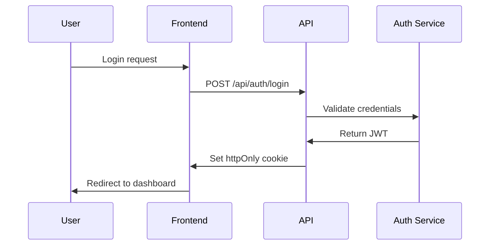

# 🏗️ 技術設計ステージ

**要件仕様書を実装可能な詳細技術アーキテクチャに変換します。**

Claude Codeのアドバンスドパターンと並列処理最適化を適用し、要件分析の成果物を基に具体的なコンポーネント設計、API仕様、データ構造、セキュリティ対策を定義し、開発者が迷うことなく実装できる技術仕様書を作成します。

## 🚀 Claude Code 高度最適化戦略

- **並列アーキテクチャ**: 独立コンポーネントの同時開発を可能にする設計
- **モジュラー設計**: 疎結合・高凝集のSOLID原則適用
- **コンテキスト最適化**: Mermaid図表での効率的な情報伝達
- **テストドリブン設計**: 自動テストを考慮したアーキテクチャ

## 📝 使用法

```bash
/step-2-design   # 要件書を自動読み込みして技術設計を実行
```

**前提条件**: `/step-1-requirements` の実行完了または `.tmp/step-1-requirements.md` の存在

## 📋 入力・出力仕様

### 入力要件

- **要件書**: `.tmp/step-1-requirements.md` - 完成した要件仕様書
- **プロジェクト環境**: `@package/ui` など既存アセットの情報

### 出力仕様

- **ファイル**: `.tmp/step-2-design.md`
- **フォーマット**: 技術仕様書（Mermaid図表含む）
- **内容**: アーキテクチャ、コンポーネント設計、API仕様、セキュリティ設計

## 🎯 設計目標

### アーキテクチャ設計原則

1. **🚀 スケーラビリティ**: 将来の成長に対応可能な設計
   - モジュラーアーキテクチャの採用
   - マイクロサービス志向のコンポーネント分割
   - 水平拡張可能なデータ構造

2. **🔧 保守性**: クリーンで理解しやすいモジュラー設計
   - SOLID原則の遵守
   - 疎結合・高凝集の実現
   - 明確な責任分担

3. **⚡ パフォーマンス**: 最初から最適化を組み込む
   - 遅延読み込みとコード分割
   - キャッシュ戦略の設計
   - バンドルサイズの最適化

4. **🔒 セキュリティ**: 組み込み型セキュリティ対策
   - 認証・認可の多層防御
   - XSS/CSRF対策の標準実装
   - データ暗号化とプライバシー保護

5. **🧪 テスタビリティ**: テスト容易性を考慮した設計
   - 依存性注入パターンの活用
   - モック化可能なインターfaces
   - 単体・統合・E2Eテストの実行環境

## 📐 Design Template

````markdown
# 技術設計書 - [プロジェクト名]

**作成日**: YYYY-MM-DD  
**バージョン**: 1.0  
**基準文書**: `.tmp/step-1-requirements.md`

## 1. アーキテクチャ概要

### 1.1 システム構成図

```mermaid
graph TB
    subgraph "Frontend"
        A[Next.js App] --> B[React Components]
        B --> C[@package/ui]
        B --> D[Custom Components]
    end

    subgraph "State Management"
        E[Zustand/Context]
    end

    subgraph "API Layer"
        F[API Routes]
        G[Mock Service Worker]
    end

    A --> E
    E --> F
    F --> G
```

### 1.2 技術スタック

| Layer      | Technology   | Version | Rationale               |
| ---------- | ------------ | ------- | ----------------------- |
| Frontend   | Next.js      | 15.x    | App Router, RSC support |
| UI Library | React        | 19.x    | Latest features         |
| Styling    | Tailwind CSS | 3.x     | Utility-first CSS       |
| State      | Zustand      | 4.x     | Simple, performant      |
| Testing    | Vitest       | Latest  | Fast, ESM support       |

## 2. ディレクトリ構造

```
src/
├── app/                    # Next.js App Router
│   ├── (auth)/            # Auth group
│   ├── api/               # API routes
│   └── layout.tsx         # Root layout
├── components/            # React components
│   ├── ui/               # UI components
│   └── features/         # Feature components
├── hooks/                # Custom hooks
├── lib/                  # Utilities
├── services/             # API services
├── stores/               # State management
├── types/                # TypeScript types
└── utils/                # Helper functions
```

## 3. コンポーネント設計

### 3.1 コンポーネント階層

```mermaid
graph TD
    A[App Layout] --> B[Header]
    A --> C[Main Content]
    A --> D[Footer]

    C --> E[Feature Component]
    E --> F[@package/ui Components]
    E --> G[Custom Components]
```

### 3.2 コンポーネント仕様

#### 既存コンポーネント活用 (@package/ui)

| Component | Usage              | Props                  | Customization  |
| --------- | ------------------ | ---------------------- | -------------- |
| Button    | CTA, Actions       | variant, size, onClick | Theme tokens   |
| Card      | Content containers | children, className    | Border, shadow |
| Modal     | Dialogs            | open, onClose          | Animations     |

#### カスタムコンポーネント

```typescript
// Example: FeatureComponent
interface FeatureComponentProps {
  data: FeatureData;
  onAction: (id: string) => void;
  loading?: boolean;
}

const FeatureComponent: React.FC<FeatureComponentProps> = ({
  data,
  onAction,
  loading = false,
}) => {
  // Implementation
};
```

## 4. 状態管理設計

### 4.1 グローバル状態

```typescript
// Zustand Store Example
interface AppState {
  user: User | null;
  settings: Settings;
  actions: {
    setUser: (user: User) => void;
    updateSettings: (settings: Partial<Settings>) => void;
  };
}
```

### 4.2 ローカル状態

- Form state: React Hook Form
- UI state: useState/useReducer
- Server state: TanStack Query

## 5. API設計

### 5.1 エンドポイント設計

```typescript
// API Route Handler Example
// app/api/users/route.ts
export async function GET(request: Request) {
  // Implementation
}

export async function POST(request: Request) {
  // Implementation
}
```

### 5.2 データモデル

```typescript
// Type Definitions
interface User {
  id: string;
  email: string;
  profile: UserProfile;
  createdAt: Date;
  updatedAt: Date;
}

interface UserProfile {
  name: string;
  avatar?: string;
  preferences: UserPreferences;
}
```

## 6. モックデータ戦略

### 6.1 Mock Service Worker設定

```typescript
// mocks/handlers.ts
export const handlers = [
  rest.get("/api/users", (req, res, ctx) => {
    return res(ctx.json(mockUsers));
  }),
];
```

### 6.2 開発用モックデータ

```typescript
// mocks/data/users.ts
export const mockUsers: User[] = [
  {
    id: "1",
    email: "test@example.com",
    profile: {
      name: "Test User",
      preferences: defaultPreferences,
    },
    createdAt: new Date("2024-01-01"),
    updatedAt: new Date("2024-01-01"),
  },
];
```

## 7. セキュリティ設計

### 7.1 認証フロー



### 7.2 セキュリティ対策

- CSRF Protection: Next.js built-in
- XSS Prevention: React escaping
- Input Validation: Zod schemas
- Rate Limiting: API middleware

## 8. パフォーマンス最適化

### 8.1 フロントエンド最適化

- Code splitting: Dynamic imports
- Image optimization: next/image
- Font optimization: next/font
- Bundle analysis: @next/bundle-analyzer

### 8.2 キャッシング戦略

```typescript
// Cache configuration
const cacheConfig = {
  static: 31536000, // 1 year
  api: 300, // 5 minutes
  ssr: 60, // 1 minute
};
```

## 9. エラーハンドリング

### 9.1 エラー境界

```typescript
// Error Boundary Component
class ErrorBoundary extends React.Component {
  // Implementation
}
```

### 9.2 APIエラー処理

```typescript
// Standardized error response
interface APIError {
  code: string;
  message: string;
  details?: Record<string, any>;
}
```

## 10. テスト設計

### 10.1 テスト戦略

| Type        | Tool            | Coverage Target |
| ----------- | --------------- | --------------- |
| Unit        | Vitest          | 80%             |
| Integration | Testing Library | Critical paths  |
| E2E         | Playwright      | User journeys   |

### 10.2 テストパターン

```typescript
// Component test example
describe("FeatureComponent", () => {
  it("should render correctly", () => {
    // Test implementation
  });
});
```

## 11. デプロイメント設計

### 11.1 環境構成

| Environment | Purpose   | URL                 |
| ----------- | --------- | ------------------- |
| Development | Local dev | localhost:3000      |
| Staging     | Testing   | staging.example.com |
| Production  | Live      | example.com         |

### 11.2 CI/CDパイプライン

```yaml
# GitHub Actions workflow
name: Deploy
on:
  push:
    branches: [main]
jobs:
  test:
    # Test steps
  deploy:
    # Deploy steps
```

## 12. 実装優先順位

### Phase 1: Core Features (MVP)

1. Basic UI structure
2. Authentication
3. Core functionality

### Phase 2: Enhanced Features

1. Advanced features
2. Performance optimizations
3. Analytics integration

## 13. リスクと対策

| Risk                  | Impact | Mitigation              |
| --------------------- | ------ | ----------------------- |
| API delays            | High   | Use mock data           |
| Browser compatibility | Medium | Progressive enhancement |
| Performance issues    | High   | Early optimization      |
````

## 🚀 実行プロセス

### フェーズ1: 要件理解と課題抽出

- **📖 要件書の詳細分析**: `.tmp/step-1-requirements.md` の全体理解
- **🎯 技術的課題の特定**: 実装上の難しさとリスクの洗い出し
- **🔍 既存資産の調査**: `@package/ui` など活用可能なコンポーネントの確認
- **📊 非機能要件の技術的解釈**: 性能・セキュリティ要件の具体化

### フェーズ2: アーキテクチャ全体設計

- **🏗️ システム構造の設計**: レイヤー構成とコンポーネント分割
- **🔗 インテグレーション設計**: 外部システムとの連携方式
- **📊 データフロー設計**: 情報の流れと変換プロセス
- **🔄 状態管理戦略**: グローバル・ローカル状態の管理方針

### フェーズ3: コンポーネント詳細設計

- **⚙️ UI コンポーネント仕様**: Props、イベント、スタイル定義
- **🔌 API 設計**: エンドポイント、リクエスト・レスポンス仕様
- **🗃️ データモデル設計**: エンティティ構造と関係性
- **🔒 セキュリティ実装方針**: 認証・認可・データ保護の具体策

### フェーズ4: 品質・性能設計

- **🧪 テスト戦略**: 単体・統合・E2Eテストの方針
- **⚡ パフォーマンス対策**: 最適化ポイントと実装方法
- **🚨 エラーハンドリング**: 例外処理とフォールバック戦略
- **📱 レスポンシブ対応**: モバイル・デスクトップ対応方針

## 🚨 エラーハンドリング

### よくある問題と対策

| 問題                       | 原因             | 対処法                           |
| -------------------------- | ---------------- | -------------------------------- |
| 要件書が見つからない       | Step1未実行      | `/step-1-requirements`を先に実行 |
| 要件が技術的に実現困難     | 複雑・新技術要件 | 代替案検討・段階的実装計画       |
| @package/ui情報不足        | 既存資産調査不足 | コンポーネント一覧の詳細確認     |
| アーキテクチャが過度に複雑 | 要件の過剰解釈   | YAGNI原則に従いシンプル化        |

### 設計品質の改善ループ

```bash
# 1. 要件書更新後の再設計
/step-2-design   # 更新された要件を自動反映

# 2. 段階的詳細化
# まず高レベル設計 → 詳細設計を段階的に追加
```

## 💡 Claude Code 特化設計原則とベストプラクティス

### 核心設計原則 (Claude Code 最適化版)

- **🔧 SOLID原則 + 並列性**: 保守性と並列実行性を両立する設計
  - **S**ingle Responsibility + **並列性**: 単一責任で依存性を最小化
  - **O**pen/Closed + **拡張性**: 新機能追加時の並列開発を考慮
  - **L**iskov Substitution + **テスト性**: モック化とテスト並列実行
  - **I**nterface Segregation + **独立性**: インターフェース分離で開発独立性確保
  - **D**ependency Inversion + **モジュール性**: 依存性逆転で並列実装可能

- **🔄 DRY原則 + 効率性**: 重複排除とClaude Code効率化
- **💋 KISS原則 + 可読性**: シンプル設計で人間とClaude両方が理解しやすく
- **🚫 YAGNI原則 + 段階実装**: 過剰実装回避とMVP→拡張の段階的アプローチ

### Next.js/React 特化ベストプラクティス

- **📁 ディレクトリ構造**: App Router活用とページ構成
- **🎣 カスタムフック**: ロジック再利用とテスト容易性
- **🔄 状態管理**: Zustand/Context APIの適切な使い分け
- **⚡ 最適化**: Code Splitting、Image Optimization、Font Loading
- **🎨 スタイリング**: Tailwind CSSとコンポーネント設計

### @package/ui 活用戦略

- **🔍 既存コンポーネント優先**: カスタム作成前の徹底調査
- **🎨 テーマ拡張**: 既存デザインシステムの活用・拡張
- **📦 新コンポーネント**: 必要最小限での追加作成
- **📚 ドキュメント**: Storybook等でのコンポーネント管理

## 📊 設計品質指標

### アーキテクチャの評価基準

- [ ] **明確性**: システム構造が理解しやすい
- [ ] **拡張性**: 新機能追加時の影響範囲が限定的
- [ ] **保守性**: バグ修正・機能変更が容易
- [ ] **テスト容易性**: 単体・統合テストが効率的に実行可能
- [ ] **パフォーマンス**: 性能要件を満たす設計

### コンポーネント設計の評価基準

- [ ] **再利用性**: 複数箇所で利用可能な汎用性
- [ ] **型安全性**: TypeScript による厳密な型定義
- [ ] **Props設計**: 直感的で拡張しやすいインターフェース
- [ ] **アクセシビリティ**: WCAG 2.1準拠の実装方針
- [ ] **@package/ui整合性**: 既存デザインシステムとの調和

### 次ステージへの準備度

- [ ] 実装に必要な全ての技術仕様が明確
- [ ] 依存関係とリスクが特定済み
- [ ] パフォーマンス・セキュリティ対策が具体化
- [ ] タスク分解に十分な詳細レベル
