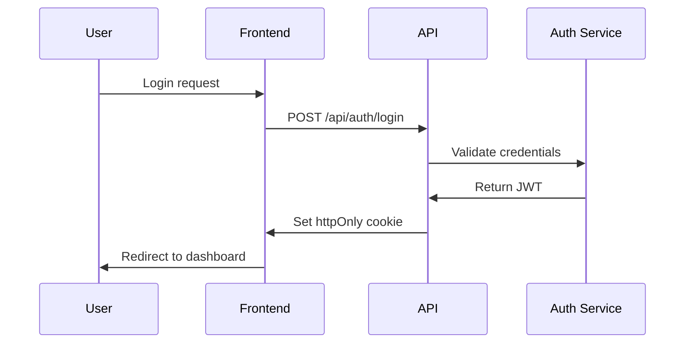

# Technical Design Stage

Transform requirements into detailed technical architecture and implementation design.

## 📋 Prerequisites

- Input: `.tmp/step-1-requirements.md`
- Output: `.tmp/step-2-design.md`

## 🎯 Design Objectives

### Architecture Goals

1. **Scalability**: Design for growth
2. **Maintainability**: Clean, modular architecture
3. **Performance**: Optimize from the start
4. **Security**: Built-in security measures
5. **Testability**: Design for testing

## 📐 Design Template

````markdown
# 技術設計書 - [プロジェクト名]

**作成日**: YYYY-MM-DD  
**バージョン**: 1.0  
**基準文書**: `.tmp/step-1-requirements.md`

## 1. アーキテクチャ概要

### 1.1 システム構成図

```mermaid
graph TB
    subgraph "Frontend"
        A[Next.js App] --> B[React Components]
        B --> C[@package/ui]
        B --> D[Custom Components]
    end

    subgraph "State Management"
        E[Zustand/Context]
    end

    subgraph "API Layer"
        F[API Routes]
        G[Mock Service Worker]
    end

    A --> E
    E --> F
    F --> G
```

### 1.2 技術スタック

| Layer      | Technology   | Version | Rationale               |
| ---------- | ------------ | ------- | ----------------------- |
| Frontend   | Next.js      | 15.x    | App Router, RSC support |
| UI Library | React        | 19.x    | Latest features         |
| Styling    | Tailwind CSS | 3.x     | Utility-first CSS       |
| State      | Zustand      | 4.x     | Simple, performant      |
| Testing    | Vitest       | Latest  | Fast, ESM support       |

## 2. ディレクトリ構造

```
src/
├── app/                    # Next.js App Router
│   ├── (auth)/            # Auth group
│   ├── api/               # API routes
│   └── layout.tsx         # Root layout
├── components/            # React components
│   ├── ui/               # UI components
│   └── features/         # Feature components
├── hooks/                # Custom hooks
├── lib/                  # Utilities
├── services/             # API services
├── stores/               # State management
├── types/                # TypeScript types
└── utils/                # Helper functions
```

## 3. コンポーネント設計

### 3.1 コンポーネント階層

```mermaid
graph TD
    A[App Layout] --> B[Header]
    A --> C[Main Content]
    A --> D[Footer]

    C --> E[Feature Component]
    E --> F[@package/ui Components]
    E --> G[Custom Components]
```

### 3.2 コンポーネント仕様

#### 既存コンポーネント活用 (@package/ui)

| Component | Usage              | Props                  | Customization  |
| --------- | ------------------ | ---------------------- | -------------- |
| Button    | CTA, Actions       | variant, size, onClick | Theme tokens   |
| Card      | Content containers | children, className    | Border, shadow |
| Modal     | Dialogs            | open, onClose          | Animations     |

#### カスタムコンポーネント

```typescript
// Example: FeatureComponent
interface FeatureComponentProps {
  data: FeatureData;
  onAction: (id: string) => void;
  loading?: boolean;
}

const FeatureComponent: React.FC<FeatureComponentProps> = ({
  data,
  onAction,
  loading = false,
}) => {
  // Implementation
};
```

## 4. 状態管理設計

### 4.1 グローバル状態

```typescript
// Zustand Store Example
interface AppState {
  user: User | null;
  settings: Settings;
  actions: {
    setUser: (user: User) => void;
    updateSettings: (settings: Partial<Settings>) => void;
  };
}
```

### 4.2 ローカル状態

- Form state: React Hook Form
- UI state: useState/useReducer
- Server state: TanStack Query

## 5. API設計

### 5.1 エンドポイント設計

```typescript
// API Route Handler Example
// app/api/users/route.ts
export async function GET(request: Request) {
  // Implementation
}

export async function POST(request: Request) {
  // Implementation
}
```

### 5.2 データモデル

```typescript
// Type Definitions
interface User {
  id: string;
  email: string;
  profile: UserProfile;
  createdAt: Date;
  updatedAt: Date;
}

interface UserProfile {
  name: string;
  avatar?: string;
  preferences: UserPreferences;
}
```

## 6. モックデータ戦略

### 6.1 Mock Service Worker設定

```typescript
// mocks/handlers.ts
export const handlers = [
  rest.get("/api/users", (req, res, ctx) => {
    return res(ctx.json(mockUsers));
  }),
];
```

### 6.2 開発用モックデータ

```typescript
// mocks/data/users.ts
export const mockUsers: User[] = [
  {
    id: "1",
    email: "test@example.com",
    profile: {
      name: "Test User",
      preferences: defaultPreferences,
    },
    createdAt: new Date("2024-01-01"),
    updatedAt: new Date("2024-01-01"),
  },
];
```

## 7. セキュリティ設計

### 7.1 認証フロー



### 7.2 セキュリティ対策

- CSRF Protection: Next.js built-in
- XSS Prevention: React escaping
- Input Validation: Zod schemas
- Rate Limiting: API middleware

## 8. パフォーマンス最適化

### 8.1 フロントエンド最適化

- Code splitting: Dynamic imports
- Image optimization: next/image
- Font optimization: next/font
- Bundle analysis: @next/bundle-analyzer

### 8.2 キャッシング戦略

```typescript
// Cache configuration
const cacheConfig = {
  static: 31536000, // 1 year
  api: 300, // 5 minutes
  ssr: 60, // 1 minute
};
```

## 9. エラーハンドリング

### 9.1 エラー境界

```typescript
// Error Boundary Component
class ErrorBoundary extends React.Component {
  // Implementation
}
```

### 9.2 APIエラー処理

```typescript
// Standardized error response
interface APIError {
  code: string;
  message: string;
  details?: Record<string, any>;
}
```

## 10. テスト設計

### 10.1 テスト戦略

| Type        | Tool            | Coverage Target |
| ----------- | --------------- | --------------- |
| Unit        | Vitest          | 80%             |
| Integration | Testing Library | Critical paths  |
| E2E         | Playwright      | User journeys   |

### 10.2 テストパターン

```typescript
// Component test example
describe("FeatureComponent", () => {
  it("should render correctly", () => {
    // Test implementation
  });
});
```

## 11. デプロイメント設計

### 11.1 環境構成

| Environment | Purpose   | URL                 |
| ----------- | --------- | ------------------- |
| Development | Local dev | localhost:3000      |
| Staging     | Testing   | staging.example.com |
| Production  | Live      | example.com         |

### 11.2 CI/CDパイプライン

```yaml
# GitHub Actions workflow
name: Deploy
on:
  push:
    branches: [main]
jobs:
  test:
    # Test steps
  deploy:
    # Deploy steps
```

## 12. 実装優先順位

### Phase 1: Core Features (MVP)

1. Basic UI structure
2. Authentication
3. Core functionality

### Phase 2: Enhanced Features

1. Advanced features
2. Performance optimizations
3. Analytics integration

## 13. リスクと対策

| Risk                  | Impact | Mitigation              |
| --------------------- | ------ | ----------------------- |
| API delays            | High   | Use mock data           |
| Browser compatibility | Medium | Progressive enhancement |
| Performance issues    | High   | Early optimization      |
````

## 🚀 実行プロセス

1. **要件分析**
   - 要件書を詳細に読み込む
   - 技術的課題を特定

2. **アーキテクチャ設計**
   - システム全体の構造を設計
   - コンポーネント間の関係を定義

3. **詳細設計**
   - 各コンポーネントの仕様を定義
   - インターフェースを明確化

4. **検証**
   - 要件との整合性確認
   - 実装可能性の検証

## 💡 設計原則

- **SOLID原則**: 保守性の高い設計
- **DRY原則**: 重複を避ける
- **KISS原則**: シンプルに保つ
- **YAGNI原則**: 必要になるまで作らない
