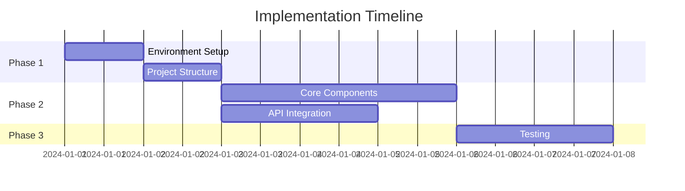
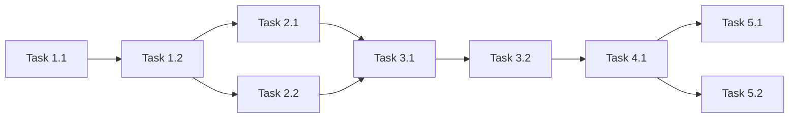

# Task Planning Stage

Break down technical design into actionable, atomic tasks with clear dependencies and quality gates.

## 📋 Prerequisites

- Input: `.tmp/step-1-requirements.md`, `.tmp/step-2-design.md`
- Output: `.tmp/step-3-tasks.md`

## 🎯 Planning Objectives

### Task Characteristics

1. **Atomic**: Each task completes one specific outcome
2. **Measurable**: Clear completion criteria
3. **Independent**: Minimize dependencies
4. **Testable**: Verifiable results
5. **Time-boxed**: Realistic estimates

## 📝 Task List Template

````markdown
# タスクリスト - [プロジェクト名]

**作成日**: YYYY-MM-DD  
**バージョン**: 1.0  
**基準文書**:

- 要件: `.tmp/step-1-requirements.md`
- 設計: `.tmp/step-2-design.md`

## エグゼクティブサマリー

| Metric           | Value     |
| ---------------- | --------- |
| 総タスク数       | XX        |
| 推定工数         | XX 時間   |
| 並列実行可能     | XX%       |
| クリティカルパス | XX タスク |

## タスク依存関係図


````

## Phase 1: 基盤構築

### Task 1.1: 開発環境セットアップ

**目的**: プロジェクトの基盤を構築

**実装内容**:

- [ ] プロジェクト初期化
- [ ] 必要な依存関係のインストール
- [ ] 開発ツールの設定
- [ ] 環境変数の設定

**技術詳細**:

```bash
# 実行コマンド例
pnpm create next-app@latest
pnpm add zustand @tanstack/react-query
```

**品質保証**:

- [ ] `pnpm install` - 依存関係インストール
- [ ] `pnpm lint:fix` - コード自動修正
- [ ] `pnpm format` - コードフォーマット
- [ ] `pnpm lint` - Lintチェック
- [ ] `pnpm typecheck` - 型チェック
- [ ] `pnpm build` - ビルド確認

**完了条件**:

- ビルドが成功する
- 開発サーバーが起動する
- 全ての品質チェックがパス

**依存**: なし  
**推定時間**: 2時間  
**担当**: -

### Task 1.2: プロジェクト構造の実装

**目的**: 設計書に基づくディレクトリ構造の作成

**実装内容**:

- [ ] srcディレクトリ構造の作成
- [ ] 基本的な設定ファイルの作成
- [ ] TypeScript設定の最適化
- [ ] パスエイリアスの設定

**技術詳細**:

```typescript
// tsconfig.json paths設定
{
  "paths": {
    "@/*": ["./src/*"],
    "@/components/*": ["./src/components/*"]
  }
}
```

**品質保証**: [同上]

**完了条件**:

- 全てのディレクトリが作成される
- インポートパスが正しく解決される

**依存**: Task 1.1  
**推定時間**: 1時間

## Phase 2: コア機能実装

### Task 2.1: UIコンポーネントの実装

**目的**: 基本的なUIコンポーネントの構築

**実装内容**:

- [ ] @package/ui の既存コンポーネント調査
- [ ] 必要なカスタムコンポーネントの特定
- [ ] コンポーネントの実装
- [ ] Storybookでのドキュメント化

**@package/ui活用計画**:
| Component | Usage | Customization |
|-----------|-------|---------------|
| Button | Primary actions | Theme colors |
| Card | Content display | Shadows |
| Modal | Dialogs | Animations |

**品質保証**: [同上]

**完了条件**:

- 全コンポーネントが正しくレンダリング
- Props型定義が完備
- アクセシビリティ基準を満たす

**依存**: Task 1.2  
**推定時間**: 4時間

### Task 2.2: 状態管理の実装

**目的**: グローバル状態管理の構築

**実装内容**:

- [ ] Zustand storeの作成
- [ ] 状態の型定義
- [ ] アクションの実装
- [ ] DevToolsの設定

**技術詳細**:

```typescript
// store/useAppStore.ts
interface AppState {
  // State definition
}
```

**品質保証**: [同上]

**完了条件**:

- 状態の読み書きが正常動作
- TypeScript型が正しく推論
- DevToolsで状態確認可能

**依存**: Task 1.2  
**推定時間**: 3時間

## Phase 3: API・データ層

### Task 3.1: モックデータの実装

**目的**: 開発用モックデータの準備

**実装内容**:

- [ ] モックデータ構造の定義
- [ ] MSW (Mock Service Worker) のセットアップ
- [ ] APIハンドラーの実装
- [ ] エラーケースのモック

**モックデータ例**:

```typescript
// mocks/data/users.ts
export const mockUsers = [{ id: "1", name: "Test User" }];
```

**品質保証**: [同上]

**完了条件**:

- 全APIエンドポイントがモック化
- レスポンスが仕様通り
- エラーケースも網羅

**依存**: Task 2.2  
**推定時間**: 3時間

### Task 3.2: API統合レイヤーの実装

**目的**: フロントエンドとAPIの接続層構築

**実装内容**:

- [ ] API clientの作成
- [ ] React Query hooksの実装
- [ ] エラーハンドリング
- [ ] キャッシュ戦略の実装

**品質保証**: [同上]

**完了条件**:

- APIコールが正常動作
- エラーが適切にハンドリング
- キャッシュが効いている

**依存**: Task 3.1  
**推定時間**: 4時間

## Phase 4: 機能実装

### Task 4.1: [具体的な機能名]の実装

**目的**: ユーザー向け機能の実装

**実装内容**:

- [ ] UIの実装
- [ ] ビジネスロジックの実装
- [ ] 状態管理との接続
- [ ] テストの作成

**品質保証**: [同上]

**完了条件**:

- 機能が仕様通り動作
- エッジケースも考慮
- パフォーマンス基準を満たす

**依存**: Task 3.2  
**推定時間**: 6時間

## Phase 5: 品質保証・最適化

### Task 5.1: テストの実装

**目的**: 自動テストによる品質保証

**実装内容**:

- [ ] ユニットテストの作成
- [ ] 統合テストの作成
- [ ] E2Eテストの作成
- [ ] カバレッジ目標達成

**テスト戦略**:
| Type | Tool | Target Coverage |
|------|------|-----------------|
| Unit | Vitest | 80% |
| Integration | Testing Library | Critical paths |
| E2E | Playwright | User journeys |

**品質保証**: [同上]

**完了条件**:

- カバレッジ目標達成
- 全テストがパス
- CI/CDで自動実行

**依存**: Task 4.1  
**推定時間**: 4時間

### Task 5.2: パフォーマンス最適化

**目的**: アプリケーションの最適化

**実装内容**:

- [ ] バンドルサイズ分析
- [ ] コード分割の実装
- [ ] 画像最適化
- [ ] Lighthouse監査

**品質保証**: [同上]

**完了条件**:

- Lighthouseスコア90以上
- FCP < 1.8s
- TTI < 3.8s

**依存**: Task 5.1  
**推定時間**: 3時間

## 実装ガイドライン

### 並列実行戦略



### タスク実行手順

1. **タスク開始時**
   - TodoWriteでステータスを`in_progress`に更新
   - 関連ドキュメントを確認

2. **実装中**
   - コミットは小さく頻繁に
   - 品質チェックを定期実行

3. **タスク完了時**
   - 全品質チェックを実行
   - TodoWriteでステータスを`completed`に更新
   - 次のタスクの準備

### リスク管理

| Risk           | Impact | Mitigation         |
| -------------- | ------ | ------------------ |
| 依存関係の遅延 | High   | 並列タスクを優先   |
| 技術的課題     | Medium | 早期のスパイク実施 |
| 仕様変更       | High   | 段階的な実装       |

## まとめ

**次のアクション**:

1. Task 1.1から開始
2. 並列実行可能なタスクは同時進行
3. 日次で進捗確認

```

## 🚀 実行プロセス

1. **設計書分析**
   - 技術設計を詳細に確認
   - 実装単位を特定

2. **タスク分解**
   - 大きなタスクを小さく分割
   - 依存関係を明確化

3. **優先順位付け**
   - クリティカルパスを特定
   - 並列実行機会を最大化

4. **TodoList登録**
   - 主要タスクをTodoWriteに登録
   - 進捗管理の準備

## 💡 タスク設計原則

- **1-2-4-8ルール**: 1日以内、理想は2-4時間、最大8時間
- **INVEST原則**: Independent, Negotiable, Valuable, Estimable, Small, Testable
- **完了の定義**: 明確で測定可能な完了条件
- **品質ゲート**: 各タスクに品質保証ステップを含める
```
