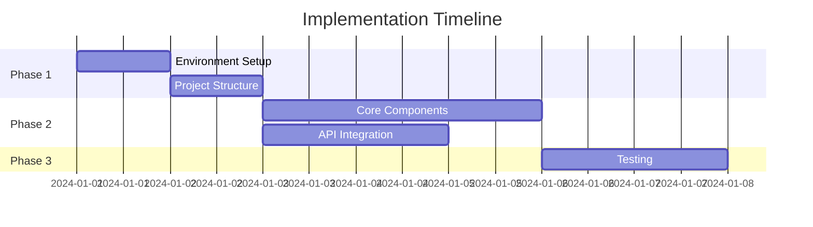
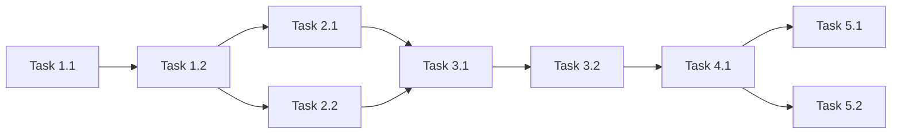

# 📝 タスク計画ステージ

**技術設計を実行可能なアトミックタスクに分解し、効率的な実装計画を策定します。**

このステージでは、技術仕様書を基に具体的な実装タスクを作成し、依存関係を明確化して並列実行可能な作業計画を立てます。TodoWriteと連携して実装追跡も準備します。

## 📝 使用法

```bash
/step-3-tasks   # 要件書・設計書を自動読み込みしてタスク計画を実行
```

**前提条件**: `/step-1-requirements` と `/step-2-design` の実行完了

## 📋 入力・出力仕様

### 入力要件

- **要件書**: `.tmp/step-1-requirements.md` - 完成した要件仕様書
- **設計書**: `.tmp/step-2-design.md` - 完成した技術設計書
- **プロジェクト状況**: 既存コードベースと開発環境

### 出力仕様

- **タスク計画書**: `.tmp/step-3-tasks.md` - 詳細実装計画
- **TodoList**: TodoWrite連携による進捗管理システム
- **依存関係図**: Mermaid形式のタスク関係可視化

## 🎯 計画目標

### Claude Code 特化タスク設計の5原則

1. **⚛️ アトミック性 + 並列実行最適化**: 各タスクは1つの明確な成果物を生成
   - 単一の機能・コンポーネント・ファイルに焦点し、他タスクと独立
   - Claude Codeの並列処理能力を活かした同時実行設計
   - Gitコミット単位として適切なサイズ（レビュー可能性を考慮）

2. **📏 測定可能性**: 明確な完了基準と品質ゲート
   - 動作確認可能な成果物
   - 自動テスト・品質チェックでの検証
   - レビュー可能な形での提出

3. **🔄 独立性**: 依存関係を最小化した並列実行性
   - 他タスクの完了を待たずに開始可能
   - 必要な依存関係は明確に文書化
   - ブロッカーの早期特定と回避策

4. **🧪 テスト可能性**: 検証・検査が確実に実行できる
   - 単体・統合テストでの品質確認
   - 動作確認のための具体的手順
   - エラーケースの検証方法

5. **⏱️ 時間管理**: 現実的で予測可能な工数見積もり
   - 1-8時間の実装可能範囲
   - 理想は2-4時間での完了
   - バッファを含む現実的な計画

## 📝 Task List Template

````markdown
# タスクリスト - [プロジェクト名]

**作成日**: YYYY-MM-DD  
**バージョン**: 1.0  
**基準文書**:

- 要件: `.tmp/step-1-requirements.md`
- 設計: `.tmp/step-2-design.md`

## エグゼクティブサマリー

| Metric           | Value     |
| ---------------- | --------- |
| 総タスク数       | XX        |
| 推定工数         | XX 時間   |
| 並列実行可能     | XX%       |
| クリティカルパス | XX タスク |

## タスク依存関係図


````

## Phase 1: 基盤構築

### Task 1.1: 開発環境セットアップ

**目的**: プロジェクトの基盤を構築

**実装内容**:

- [ ] プロジェクト初期化
- [ ] 必要な依存関係のインストール
- [ ] 開発ツールの設定
- [ ] 環境変数の設定

**技術詳細**:

```bash
# プロジェクト作成
pnpm create next-app@latest

# パッケージ追加 (package.json直接編集推奨)
# 1. package.jsonの dependencies に追加:
#    "zustand": "^4.5.2",
#    "@tanstack/react-query": "^5.17.15"
# 2. インストール実行
pnpm install
```

**パッケージ管理方針:**

- パッケージ追加は `package.json` を直接編集してから `pnpm install`
- Windows環境での確実性を重視した方法

**品質保証**:

- [ ] `pnpm install` - 依存関係インストール
- [ ] `pnpm lint:fix` - コード自動修正
- [ ] `pnpm format` - コードフォーマット
- [ ] `pnpm lint` - Lintチェック
- [ ] `pnpm typecheck` - 型チェック
- [ ] `pnpm build` - ビルド確認

**完了条件**:

- ビルドが成功する
- 開発サーバーが起動する
- 全ての品質チェックがパス

**依存**: なし  
**推定時間**: 2時間  
**担当**: -

### Task 1.2: プロジェクト構造の実装

**目的**: 設計書に基づくディレクトリ構造の作成

**実装内容**:

- [ ] srcディレクトリ構造の作成
- [ ] 基本的な設定ファイルの作成
- [ ] TypeScript設定の最適化
- [ ] パスエイリアスの設定

**技術詳細**:

```typescript
// tsconfig.json paths設定
{
  "paths": {
    "@/*": ["./src/*"],
    "@/components/*": ["./src/components/*"]
  }
}
```

**品質保証**: [同上]

**完了条件**:

- 全てのディレクトリが作成される
- インポートパスが正しく解決される

**依存**: Task 1.1  
**推定時間**: 1時間

## Phase 2: コア機能実装

### Task 2.1: UIコンポーネントの実装

**目的**: 基本的なUIコンポーネントの構築

**実装内容**:

- [ ] @package/ui の既存コンポーネント調査
- [ ] 必要なカスタムコンポーネントの特定
- [ ] コンポーネントの実装
- [ ] Storybookでのドキュメント化

**@package/ui活用計画**:
| Component | Usage | Customization |
|-----------|-------|---------------|
| Button | Primary actions | Theme colors |
| Card | Content display | Shadows |
| Modal | Dialogs | Animations |

**品質保証**: [同上]

**完了条件**:

- 全コンポーネントが正しくレンダリング
- Props型定義が完備
- アクセシビリティ基準を満たす

**依存**: Task 1.2  
**推定時間**: 4時間

### Task 2.2: 状態管理の実装

**目的**: グローバル状態管理の構築

**実装内容**:

- [ ] Zustand storeの作成
- [ ] 状態の型定義
- [ ] アクションの実装
- [ ] DevToolsの設定

**技術詳細**:

```typescript
// store/useAppStore.ts
interface AppState {
  // State definition
}
```

**品質保証**: [同上]

**完了条件**:

- 状態の読み書きが正常動作
- TypeScript型が正しく推論
- DevToolsで状態確認可能

**依存**: Task 1.2  
**推定時間**: 3時間

## Phase 3: API・データ層

### Task 3.1: モックデータの実装

**目的**: 開発用モックデータの準備

**実装内容**:

- [ ] モックデータ構造の定義
- [ ] MSW (Mock Service Worker) のセットアップ
- [ ] APIハンドラーの実装
- [ ] エラーケースのモック

**モックデータ例**:

```typescript
// mocks/data/users.ts
export const mockUsers = [{ id: "1", name: "Test User" }];
```

**品質保証**: [同上]

**完了条件**:

- 全APIエンドポイントがモック化
- レスポンスが仕様通り
- エラーケースも網羅

**依存**: Task 2.2  
**推定時間**: 3時間

### Task 3.2: API統合レイヤーの実装

**目的**: フロントエンドとAPIの接続層構築

**実装内容**:

- [ ] API clientの作成
- [ ] React Query hooksの実装
- [ ] エラーハンドリング
- [ ] キャッシュ戦略の実装

**品質保証**: [同上]

**完了条件**:

- APIコールが正常動作
- エラーが適切にハンドリング
- キャッシュが効いている

**依存**: Task 3.1  
**推定時間**: 4時間

## Phase 4: 機能実装

### Task 4.1: [具体的な機能名]の実装

**目的**: ユーザー向け機能の実装

**実装内容**:

- [ ] UIの実装
- [ ] ビジネスロジックの実装
- [ ] 状態管理との接続
- [ ] テストの作成

**品質保証**: [同上]

**完了条件**:

- 機能が仕様通り動作
- エッジケースも考慮
- パフォーマンス基準を満たす

**依存**: Task 3.2  
**推定時間**: 6時間

## Phase 5: 品質保証・最適化

### Task 5.1: テストの実装

**目的**: 自動テストによる品質保証

**実装内容**:

- [ ] ユニットテストの作成
- [ ] 統合テストの作成
- [ ] E2Eテストの作成
- [ ] カバレッジ目標達成

**テスト戦略**:
| Type | Tool | Target Coverage |
|------|------|-----------------|
| Unit | Vitest | 80% |
| Integration | Testing Library | Critical paths |
| E2E | Playwright | User journeys |

**品質保証**: [同上]

**完了条件**:

- カバレッジ目標達成
- 全テストがパス
- CI/CDで自動実行

**依存**: Task 4.1  
**推定時間**: 4時間

### Task 5.2: パフォーマンス最適化

**目的**: アプリケーションの最適化

**実装内容**:

- [ ] バンドルサイズ分析
- [ ] コード分割の実装
- [ ] 画像最適化
- [ ] Lighthouse監査

**品質保証**: [同上]

**完了条件**:

- Lighthouseスコア90以上
- FCP < 1.8s
- TTI < 3.8s

**依存**: Task 5.1  
**推定時間**: 3時間

## 実装ガイドライン

### 並列実行戦略



### タスク実行手順

1. **タスク開始時**
   - TodoWriteでステータスを`in_progress`に更新
   - 関連ドキュメントを確認

2. **実装中**
   - コミットは小さく頻繁に
   - 品質チェックを定期実行

3. **タスク完了時**
   - 全品質チェックを実行
   - TodoWriteでステータスを`completed`に更新
   - 次のタスクの準備

### リスク管理

| Risk           | Impact | Mitigation         |
| -------------- | ------ | ------------------ |
| 依存関係の遅延 | High   | 並列タスクを優先   |
| 技術的課題     | Medium | 早期のスパイク実施 |
| 仕様変更       | High   | 段階的な実装       |

## まとめ

**次のアクション**:

1. Task 1.1から開始
2. 並列実行可能なタスクは同時進行
3. 日次で進捗確認

````

## 🚀 実行プロセス

### ステップ1: 設計書解析と実装単位特定
- **📖 設計書の詳細分析**: `.tmp/step-2-design.md` の全体把握
- **🔍 実装ポイントの抽出**: コンポーネント、API、データ層の特定
- **📊 複雑度評価**: 各実装ポイントの難易度とリスク算定
- **🎯 MVP範囲の確認**: 優先度の高い機能の明確化

### ステップ2: アトミックタスクへの分解
- **⚛️ 最小実装単位への分割**: 1機能1タスクの原則
- **🔗 依存関係の洗い出し**: 前提となるタスクの明確化
- **⏱️ 工数見積もり**: 現実的な時間配分（1-8時間範囲）
- **🧪 品質ゲートの設定**: 各タスクの完了条件定義

### ステップ3: 実行計画の最適化
- **🛤️ クリティカルパスの特定**: プロジェクト全体のボトルネック分析
- **⚡ 並列実行機会の最大化**: 独立タスクの同時実行計画
- **🔄 リスク軽減策の策定**: 代替案と回避策の準備
- **📈 段階的リリース計画**: MVP→拡張機能の段階設定

### ステップ4: TodoList統合と進捗管理準備
- **📝 主要タスクの TodoWrite 登録**: 重要タスクの追跡システム設定
- **🔄 状態管理フローの確立**: pending→in_progress→completed
- **📊 進捗可視化の準備**: 完了率とマイルストーン設定
- **🚨 ブロッカー対応体制**: 問題発生時のエスカレーション計画

## 🚨 エラーハンドリング

### よくある問題と対策

| 問題 | 原因 | 対処法 |
|------|------|--------|
| 設計書が見つからない | Step2未実行 | `/step-2-design`を先に実行 |
| タスクが大きすぎる | 分解不足 | 2-4時間単位での細分化 |
| 依存関係が複雑すぎる | 設計の結合度高 | タスク順序の再検討・並列化 |
| 工数見積もりが不正確 | 経験不足・情報不足 | バッファ追加・段階的詳細化 |

### 計画品質の改善ループ

```bash
# 1. 設計書更新後の再計画
/step-3-tasks   # 更新された設計を自動反映

# 2. 実装途中での計画調整
# タスクの実際工数を基に残りタスクの見積もり修正
````

## 💡 Claude Code 最適化タスク設計のベストプラクティス

### 時間管理の黄金ルール (Claude Code 特化版)

- **🕐 1-2-4-8ルール + 並列実行**: 1日以内完了、理想2-4時間、最大8時間（複数タスク同時実行）
- **⏰ コンテキスト効率**: Claude Codeのコンテキスト管理を考慮した作業分割
- **📅 日次並列目標**: 1日に3-5タスクの並列実行で開発速度向上
- **🎯 週次マイルストーン + フィードバック**: 週単位機能完成と継続的改善サイクル

### INVEST原則の適用

- **I**ndependent: 他タスクに依存しない独立性
- **N**egotiable: 要件変更に対応可能な柔軟性
- **V**aluable: ユーザー・ステークホルダーへの価値
- **E**stimable: 工数見積もり可能な具体性
- **S**mall: 適切なサイズでの分割
- **T**estable: 成果物の検証可能性

### 完了の定義（Definition of Done）

- **✅ 機能実装**: 仕様通りの動作確認
- **🧪 テスト完了**: 単体・統合テストのパス
- **📏 品質チェック**: lint・type・buildの成功
- **📝 ドキュメント**: 必要な説明・コメント追加
- **👀 コードレビュー**: チーム基準での品質確認

### Claude Code × TodoWrite 高度連携戦略

- **🎯 並列実行追跡**: 複数の並列タスクを同時にTodoWriteで追跡・管理
- **🔄 リアルタイム同期**: Claude Codeセッション間でのステータス自動同期
- **📊 進捗ダッシュボード**: 完了率・並列実行率・ボトルネックの可視化
- **🚨 インテリジェントアラート**: 依存関係ブロッカーとデッドロック早期発見
- **⚡ 自動優先度調整**: 並列実行可能タスクの動的優先度最適化
- **🔄 `/clear` タイミング最適化**: コンテキスト効率を考慮したタスク切り替え

## 📊 タスク計画品質指標

### 計画の評価基準

- [ ] **分解粒度**: 全タスクが1-8時間の実装可能範囲
- [ ] **独立性**: 70%以上のタスクが並列実行可能
- [ ] **完了定義**: 各タスクに明確で測定可能な完了条件
- [ ] **依存関係**: クリティカルパスが特定・最適化済み
- [ ] **リスク対策**: 高リスクタスクに代替案・軽減策あり

### 実装準備度の評価

- [ ] **技術仕様**: 実装に必要な情報が十分
- [ ] **開発環境**: 必要なツール・依存関係が明確
- [ ] **品質保証**: テスト戦略と品質チェック体制が確立
- [ ] **進捗管理**: TodoWrite連携と状況把握体制が準備完了

### プロジェクト成功予測

- [ ] **工数精度**: 見積もりにバッファが適切に含まれる
- [ ] **段階実装**: MVP→拡張の段階的価値提供計画
- [ ] **チーム効率**: 並列作業とコラボレーション最適化
- [ ] **変更対応**: 要件変更時の影響範囲限定化
