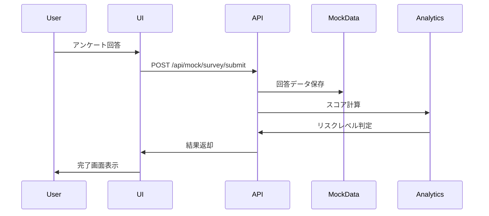

# やめどき予報 - システムアーキテクチャドキュメント

## 目次

1. [システム概要](#システム概要)
2. [技術スタック](#技術スタック)
3. [ディレクトリ構造](#ディレクトリ構造)
4. [アーキテクチャパターン](#アーキテクチャパターン)
5. [データフロー](#データフロー)
6. [認証・認可](#認証認可)
7. [状態管理](#状態管理)
8. [パフォーマンス最適化](#パフォーマンス最適化)
9. [セキュリティ設計](#セキュリティ設計)
10. [将来の拡張計画](#将来の拡張計画)

## システム概要

やめどき予報（Yamefoki Forecast）は、従業員の満足度を天気メタファーで可視化し、離職リスクを早期発見するための次世代HRダッシュボードです。

### 主要機能

- **日次アンケート**: 天気スケール（⛈️🌧️🌤️🌞☀️）での5段階評価
- **リアルタイム分析**: 個人・チーム・全社の満足度推移を可視化
- **アラート機能**: 離職リスク高の社員を自動検知・通知
- **予測分析**: AIによる離職リスク予測（天気予報メタファー）
- **ロールベースアクセス**: 従業員・管理者・HR・管理者向けの異なるビュー

## 技術スタック

### フロントエンド

```
- Framework: Next.js 15 (App Router)
- Language: TypeScript 5.x
- Styling: Tailwind CSS 4.x
- UI Components: Custom components with CVA (Class Variance Authority)
- Icons: Lucide React
- Animations: Framer Motion
- Charts: Recharts 2.x
- Forms: React Hook Form + Zod
```

### バックエンド（現在はモック実装）

```
- Runtime: Node.js 20.x
- API: Next.js API Routes (モックAPI)
- Database: モックデータ（将来的にPostgreSQL予定）
- Authentication: モック認証（将来的にNextAuth.js予定）
```

### 開発ツール

```
- Build Tool: Next.js built-in
- Package Manager: npm
- Linting: ESLint
- Formatting: Prettier
- Type Checking: TypeScript
```

## ディレクトリ構造

```
src/
├── app/                      # Next.js App Router
│   ├── (dashboard)/          # ダッシュボードグループ（認証必須）
│   │   ├── alerts/           # アラート管理
│   │   ├── analytics/        # 分析ページ
│   │   ├── dashboard/        # メインダッシュボード
│   │   ├── survey/           # アンケート機能
│   │   │   ├── page.tsx      # アンケート回答
│   │   │   └── history/      # 回答履歴
│   │   └── layout.tsx        # 共通レイアウト
│   ├── api/                  # API Routes
│   │   └── mock/             # モックAPI実装
│   │       ├── alerts/       # アラートAPI
│   │       ├── analytics/    # 分析API
│   │       ├── scoring/      # スコアリングAPI
│   │       └── survey/       # アンケートAPI
│   ├── globals.css           # グローバルスタイル
│   ├── layout.tsx            # ルートレイアウト
│   └── page.tsx              # ランディングページ
│
├── components/               # Reactコンポーネント
│   ├── alerts/               # アラート関連
│   │   ├── AlertBadge.tsx    # アラートバッジ
│   │   └── AlertList.tsx     # アラート一覧
│   ├── layout/               # レイアウト関連
│   │   ├── DashboardLayout.tsx # ダッシュボードレイアウト
│   │   ├── Header.tsx        # ヘッダー
│   │   └── Sidebar.tsx       # サイドバー
│   ├── survey/               # アンケート関連
│   │   ├── SurveyForm.tsx    # アンケートフォーム
│   │   └── SurveyCompleted.tsx # 完了画面
│   └── ui/                   # UIプリミティブ
│       ├── Alert.tsx         # アラートコンポーネント
│       ├── Badge.tsx         # バッジ
│       ├── Button.tsx        # ボタン
│       ├── Card.tsx          # カード
│       ├── Form.tsx          # フォーム要素
│       ├── Input.tsx         # 入力フィールド
│       ├── Label.tsx         # ラベル
│       ├── LoadingSpinner.tsx # ローディング
│       └── Select.tsx        # セレクトボックス
│
├── lib/                      # ユーティリティ・設定
│   ├── mock-auth.ts          # モック認証システム
│   ├── mock-data.ts          # モックデータ
│   ├── survey-utils.ts       # アンケートユーティリティ
│   └── utils.ts              # 汎用ユーティリティ
│
└── types/                    # TypeScript型定義
    └── index.ts              # 全型定義
```

## アーキテクチャパターン

### 1. レイヤードアーキテクチャ

```
┌─────────────────────────────────────────┐
│          Presentation Layer             │
│  (React Components + Next.js Pages)     │
├─────────────────────────────────────────┤
│          Application Layer              │
│    (Hooks, Utils, State Management)     │
├─────────────────────────────────────────┤
│            Data Layer                   │
│    (API Routes, Mock Data Access)       │
├─────────────────────────────────────────┤
│         Infrastructure Layer            │
│    (Database, External Services)        │
└─────────────────────────────────────────┘
```

### 2. コンポーネント設計原則

- **Atomic Design**: UIコンポーネントを原子レベルから構築
- **Compound Components**: 複雑なコンポーネントを組み合わせ可能な部品で構成
- **Container/Presentational**: ロジックとUIの分離
- **Single Responsibility**: 各コンポーネントは単一の責務を持つ

### 3. ルーティング戦略

```typescript
// App Routerのグループ化
(dashboard)/ // 認証が必要なページ群
├── layout.tsx // DashboardLayoutでラップ
├── dashboard/
├── survey/
├── analytics/
└── alerts/

// 並列ルート（将来実装予定）
@modal/ // モーダル表示用
@sidebar/ // サイドバー状態管理
```

## データフロー

### 1. アンケート回答フロー



### 2. リスク計算ロジック

```typescript
// スコア計算の流れ
1. 5つの質問への回答（1-5点）
2. カテゴリ別重み付け
   - workload: 1.0
   - relationships: 1.2
   - achievement: 1.0
   - support: 1.1
   - retention: 1.3
3. 加重平均スコア計算
4. リスクレベル判定
   - 高リスク: < 2.5
   - 中リスク: 2.5 - 4.0
   - 低リスク: > 4.0
5. 天気メタファーへマッピング
   - ⛈️ 嵐: スコア 1.0-1.9
   - 🌧️ 雨: スコア 2.0-2.9
   - 🌤️ 曇り: スコア 3.0-3.9
   - 🌞 晴れ: スコア 4.0-4.5
   - ☀️ 快晴: スコア 4.6-5.0
```

## 認証・認可

### 現在の実装（モック）

```typescript
// lib/mock-auth.ts
- ローカルストレージベースのセッション管理
- 7人のサンプルユーザー（異なるロール）
- ロール: employee, manager, hr, admin
```

### 将来の実装計画

```typescript
// NextAuth.js統合
- OAuth 2.0 (Google, Microsoft)
- JWT/セッションベース認証
- ロールベースアクセス制御（RBAC）
- 多要素認証（MFA）
```

### 認可マトリックス

| ページ/機能    | Employee | Manager | HR  | Admin |
| -------------- | -------- | ------- | --- | ----- |
| ダッシュボード | ✓        | ✓       | ✓   | ✓     |
| 個人アンケート | ✓        | ✓       | ✓   | ✓     |
| チーム統計     | -        | ✓       | ✓   | ✓     |
| 全社統計       | -        | -       | ✓   | ✓     |
| アラート管理   | -        | ✓       | ✓   | ✓     |
| システム設定   | -        | -       | -   | ✓     |

## 状態管理

### 現在の状態管理戦略

1. **ローカル状態**: React useState/useReducer
2. **セッション状態**: localStorage + カスタムフック
3. **サーバー状態**: SWR検討中（現在は直接fetch）

### 将来の状態管理計画

```typescript
// Zustand統合予定
-グローバル状態管理 -
  永続化ミドルウェア -
  DevTools統合 -
  TypeScript完全サポート;
```

## パフォーマンス最適化

### 現在の最適化

1. **コード分割**: Next.js自動コード分割
2. **画像最適化**: Next/Image使用
3. **フォント最適化**: next/font使用
4. **静的生成**: 可能な限りSSG使用
5. **動的インポート**: 重いコンポーネントの遅延読み込み

### パフォーマンス指標目標

- **LCP**: < 2.5秒
- **FID**: < 100ms
- **CLS**: < 0.1
- **TTI**: < 3.8秒

## セキュリティ設計

### 現在のセキュリティ対策

1. **入力検証**: Zodスキーマによる厳格な検証
2. **XSS対策**: React自動エスケープ
3. **HTTPS**: 本番環境でのみ強制

### 将来のセキュリティ強化

1. **CSRFトークン**: POSTリクエスト保護
2. **レート制限**: API呼び出し制限
3. **データ暗号化**: 機密データの暗号化
4. **監査ログ**: 全操作の記録
5. **セキュリティヘッダー**: HSTS, CSP等

## 将来の拡張計画

### Phase 1: 基盤強化（3ヶ月）

- [ ] 実データベース統合（PostgreSQL）
- [ ] 本格的な認証システム（NextAuth.js）
- [ ] リアルタイムデータ同期（WebSocket/SSE）
- [ ] キャッシュ層追加（Redis）

### Phase 2: 機能拡張（6ヶ月）

- [ ] チーム管理ページ実装
- [ ] 管理者設定ページ実装
- [ ] 通知システム（Email/Slack）
- [ ] レポート生成機能（PDF/Excel）
- [ ] 多言語対応（i18n）

### Phase 3: エンタープライズ機能（12ヶ月）

- [ ] AI/ML統合（予測精度向上）
- [ ] 外部システム連携（HR システム）
- [ ] モバイルアプリ（React Native）
- [ ] マルチテナント対応
- [ ] 高度な分析ダッシュボード

## まとめ

やめどき予報は、モダンなWeb技術スタックを活用し、ユーザーフレンドリーな天気メタファーを通じて複雑なHRデータを直感的に表現するシステムです。現在はMVPとして機能しており、将来的にはエンタープライズグレードのHRソリューションへと発展させる計画です。
