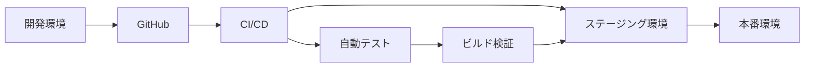

# やめどき予報 - デプロイメントガイド

## 目次

1. [デプロイメント概要](#デプロイメント概要)
2. [環境構成](#環境構成)
3. [Vercelデプロイ](#vercelデプロイ)
4. [環境変数設定](#環境変数設定)
5. [データベース設定](#データベース設定)
6. [CI/CDパイプライン](#cicdパイプライン)
7. [モニタリング設定](#モニタリング設定)
8. [セキュリティ設定](#セキュリティ設定)
9. [トラブルシューティング](#トラブルシューティング)

## デプロイメント概要

やめどき予報は、Next.js 15を使用しているため、Vercelへのデプロイが推奨されます。

### デプロイメントフロー



### 環境一覧

| 環境         | URL                                 | ブランチ   | 用途         |
| ------------ | ----------------------------------- | ---------- | ------------ |
| 開発         | http://localhost:3000               | feature/\* | ローカル開発 |
| ステージング | https://yamefoki-staging.vercel.app | develop    | テスト・検証 |
| 本番         | https://yamefoki.example.com        | main       | 本番運用     |

## 環境構成

### 必要なサービス

1. **ホスティング**: Vercel
2. **データベース**: PostgreSQL (Supabase/Neon推奨)
3. **認証**: NextAuth.js + OAuth
4. **メール**: Resend
5. **監視**: Vercel Analytics + Sentry
6. **CDN**: Vercel Edge Network

### システム要件

- Node.js 20.x
- PostgreSQL 15.x
- Redis 7.x (オプション)

## Vercelデプロイ

### 初回セットアップ

#### 1. Vercel CLIインストール

```bash
npm i -g vercel
```

#### 2. プロジェクトリンク

```bash
# プロジェクトルートで実行
cd apps/web
vercel

# 以下の質問に回答
? Set up and deploy "~/shunsaku-monorepo/apps/web"? [Y/n] Y
? Which scope do you want to deploy to? Your Team
? Link to existing project? [y/N] N
? What's your project's name? yamefoki
? In which directory is your code located? ./
? Want to override the settings? [y/N] N
```

#### 3. 環境別デプロイ

```bash
# ステージング環境
vercel --env preview

# 本番環境
vercel --prod
```

### GitHub連携設定

1. Vercelダッシュボードでプロジェクトを選択
2. Settings → Git → GitHub連携を設定
3. ブランチ設定：
   - Production Branch: `main`
   - Preview Branches: `develop`, `feature/*`

### ビルド設定

`vercel.json`:

```json
{
  "buildCommand": "npm run build",
  "outputDirectory": ".next",
  "devCommand": "npm run dev",
  "installCommand": "npm install",
  "framework": "nextjs",
  "regions": ["hnd1"],
  "functions": {
    "app/api/mock/*.ts": {
      "maxDuration": 10
    }
  },
  "headers": [
    {
      "source": "/api/(.*)",
      "headers": [
        { "key": "X-Content-Type-Options", "value": "nosniff" },
        { "key": "X-Frame-Options", "value": "DENY" },
        { "key": "X-XSS-Protection", "value": "1; mode=block" }
      ]
    }
  ],
  "redirects": [
    {
      "source": "/",
      "destination": "/dashboard",
      "permanent": false,
      "has": [
        {
          "type": "cookie",
          "key": "session"
        }
      ]
    }
  ]
}
```

## 環境変数設定

### Vercelダッシュボードでの設定

1. プロジェクト → Settings → Environment Variables
2. 以下の環境変数を設定：

#### 基本設定

```env
# アプリケーション
NEXT_PUBLIC_APP_URL=https://yamefoki.example.com
NEXT_PUBLIC_APP_NAME=やめどき予報

# 認証
NEXTAUTH_URL=https://yamefoki.example.com
NEXTAUTH_SECRET=<generate-with-openssl-rand-base64-32>
JWT_SECRET=<generate-with-openssl-rand-base64-32>
```

#### データベース設定

```env
# PostgreSQL (Supabase例)
DATABASE_URL=postgresql://postgres:[PASSWORD]@[HOST]:5432/yamefoki
DATABASE_POOL_URL=postgresql://postgres:[PASSWORD]@[HOST]:6543/yamefoki
```

#### 外部サービス

```env
# メール (Resend)
RESEND_API_KEY=re_xxxxxxxxxxxxx

# エラー監視 (Sentry)
NEXT_PUBLIC_SENTRY_DSN=https://xxxxx@sentry.io/xxxxx
SENTRY_AUTH_TOKEN=xxxxxxxxxxxxx

# 分析
NEXT_PUBLIC_VERCEL_ANALYTICS_ID=xxxxxxxxxxxxx
```

### 環境変数の暗号化

機密情報は暗号化して保存：

```bash
# 暗号化キー生成
openssl rand -base64 32

# 環境変数に設定
ENCRYPTION_KEY=生成されたキー
```

## データベース設定

### Supabaseセットアップ

1. [Supabase](https://supabase.com)でプロジェクト作成
2. SQL Editorで初期スキーマ実行：

```sql
-- Enable UUID extension
CREATE EXTENSION IF NOT EXISTS "uuid-ossp";

-- Users table
CREATE TABLE users (
    id UUID PRIMARY KEY DEFAULT uuid_generate_v4(),
    email VARCHAR(255) UNIQUE NOT NULL,
    name VARCHAR(100) NOT NULL,
    role VARCHAR(20) NOT NULL DEFAULT 'employee',
    department VARCHAR(100),
    created_at TIMESTAMP DEFAULT CURRENT_TIMESTAMP
);

-- Questions table
CREATE TABLE questions (
    id UUID PRIMARY KEY DEFAULT uuid_generate_v4(),
    text TEXT NOT NULL,
    category VARCHAR(50) NOT NULL,
    weight DECIMAL(3,2) DEFAULT 1.0,
    is_active BOOLEAN DEFAULT true,
    created_at TIMESTAMP DEFAULT CURRENT_TIMESTAMP
);

-- Surveys table
CREATE TABLE surveys (
    id UUID PRIMARY KEY DEFAULT uuid_generate_v4(),
    user_id UUID NOT NULL REFERENCES users(id),
    submitted_at TIMESTAMP DEFAULT CURRENT_TIMESTAMP,
    total_score DECIMAL(3,2) NOT NULL,
    risk_level VARCHAR(10) NOT NULL
);

-- Survey responses table
CREATE TABLE survey_responses (
    id UUID PRIMARY KEY DEFAULT uuid_generate_v4(),
    survey_id UUID NOT NULL REFERENCES surveys(id),
    question_id UUID NOT NULL REFERENCES questions(id),
    score INTEGER NOT NULL CHECK (score >= 1 AND score <= 5)
);

-- Indexes
CREATE INDEX idx_surveys_user_date ON surveys(user_id, submitted_at);
CREATE INDEX idx_surveys_risk ON surveys(risk_level);
```

### データベースマイグレーション

```bash
# マイグレーションファイル作成
npx prisma init
npx prisma migrate dev --name init

# 本番環境へのマイグレーション
npx prisma migrate deploy
```

## CI/CDパイプライン

### GitHub Actions設定

`.github/workflows/deploy.yml`:

```yaml
name: Deploy to Production

on:
  push:
    branches: [main]
  pull_request:
    branches: [main]

env:
  NODE_VERSION: "20"

jobs:
  test:
    runs-on: ubuntu-latest

    steps:
      - uses: actions/checkout@v4

      - name: Setup Node.js
        uses: actions/setup-node@v4
        with:
          node-version: ${{ env.NODE_VERSION }}
          cache: "npm"

      - name: Install dependencies
        run: npm ci
        working-directory: ./apps/web

      - name: Run linting
        run: npm run lint
        working-directory: ./apps/web

      - name: Run type check
        run: npm run type-check
        working-directory: ./apps/web

      - name: Run tests
        run: npm run test:ci
        working-directory: ./apps/web

      - name: Build application
        run: npm run build
        working-directory: ./apps/web
        env:
          NEXT_PUBLIC_APP_URL: ${{ secrets.NEXT_PUBLIC_APP_URL }}

  deploy:
    needs: test
    runs-on: ubuntu-latest
    if: github.ref == 'refs/heads/main'

    steps:
      - uses: actions/checkout@v4

      - name: Deploy to Vercel
        uses: amondnet/vercel-action@v25
        with:
          vercel-token: ${{ secrets.VERCEL_TOKEN }}
          vercel-org-id: ${{ secrets.VERCEL_ORG_ID }}
          vercel-project-id: ${{ secrets.VERCEL_PROJECT_ID }}
          vercel-args: "--prod"
          working-directory: ./apps/web
```

### プレビューデプロイ

```yaml
name: Preview Deployment

on:
  pull_request:
    types: [opened, synchronize]

jobs:
  deploy-preview:
    runs-on: ubuntu-latest

    steps:
      - uses: actions/checkout@v4

      - name: Deploy Preview
        uses: amondnet/vercel-action@v25
        with:
          vercel-token: ${{ secrets.VERCEL_TOKEN }}
          vercel-org-id: ${{ secrets.VERCEL_ORG_ID }}
          vercel-project-id: ${{ secrets.VERCEL_PROJECT_ID }}
          working-directory: ./apps/web

      - name: Comment PR
        uses: actions/github-script@v7
        with:
          script: |
            github.rest.issues.createComment({
              issue_number: context.issue.number,
              owner: context.repo.owner,
              repo: context.repo.repo,
              body: '🚀 プレビューデプロイが完了しました！'
            })
```

## モニタリング設定

### Vercel Analytics

1. Vercelダッシュボード → Analytics → Enable
2. `app/layout.tsx`に追加：

```tsx
import { Analytics } from "@vercel/analytics/react";
import { SpeedInsights } from "@vercel/speed-insights/next";

export default function RootLayout({ children }) {
  return (
    <html>
      <body>
        {children}
        <Analytics />
        <SpeedInsights />
      </body>
    </html>
  );
}
```

### Sentry設定

1. Sentryプロジェクト作成
2. `sentry.client.config.ts`:

```typescript
import * as Sentry from "@sentry/nextjs";

Sentry.init({
  dsn: process.env.NEXT_PUBLIC_SENTRY_DSN,
  environment: process.env.NODE_ENV,
  tracesSampleRate: 1.0,
  debug: false,
  replaysOnErrorSampleRate: 1.0,
  replaysSessionSampleRate: 0.1,
  integrations: [
    new Sentry.Replay({
      maskAllText: true,
      blockAllMedia: true,
    }),
  ],
});
```

### カスタムメトリクス

```typescript
// lib/monitoring.ts
export function trackEvent(
  eventName: string,
  properties?: Record<string, any>,
) {
  // Vercel Analytics
  if (typeof window !== "undefined" && window.va) {
    window.va("event", { name: eventName, ...properties });
  }

  // Sentry
  Sentry.addBreadcrumb({
    message: eventName,
    data: properties,
  });
}

// 使用例
trackEvent("survey_submitted", {
  riskLevel: "low",
  score: 4.2,
});
```

## セキュリティ設定

### セキュリティヘッダー

`next.config.js`:

```javascript
module.exports = {
  async headers() {
    return [
      {
        source: "/:path*",
        headers: [
          {
            key: "X-DNS-Prefetch-Control",
            value: "on",
          },
          {
            key: "Strict-Transport-Security",
            value: "max-age=63072000; includeSubDomains; preload",
          },
          {
            key: "X-Content-Type-Options",
            value: "nosniff",
          },
          {
            key: "X-Frame-Options",
            value: "SAMEORIGIN",
          },
          {
            key: "X-XSS-Protection",
            value: "1; mode=block",
          },
          {
            key: "Referrer-Policy",
            value: "origin-when-cross-origin",
          },
          {
            key: "Permissions-Policy",
            value: "camera=(), microphone=(), geolocation=()",
          },
          {
            key: "Content-Security-Policy",
            value: ContentSecurityPolicy.replace(/\s{2,}/g, " ").trim(),
          },
        ],
      },
    ];
  },
};

const ContentSecurityPolicy = `
  default-src 'self';
  script-src 'self' 'unsafe-eval' 'unsafe-inline' *.vercel-scripts.com;
  style-src 'self' 'unsafe-inline';
  img-src 'self' blob: data: https:;
  font-src 'self';
  connect-src 'self' *.vercel.app;
`;
```

### 環境変数の保護

```typescript
// lib/env.ts
const requiredEnvVars = [
  "DATABASE_URL",
  "NEXTAUTH_SECRET",
  "JWT_SECRET",
] as const;

export function validateEnv() {
  for (const envVar of requiredEnvVars) {
    if (!process.env[envVar]) {
      throw new Error(`Missing required environment variable: ${envVar}`);
    }
  }
}

// app/layout.tsx
import { validateEnv } from "@/lib/env";

if (process.env.NODE_ENV === "production") {
  validateEnv();
}
```

## トラブルシューティング

### よくある問題

#### 1. ビルドエラー

```bash
# エラー: Module not found
解決: npm install を実行

# エラー: TypeScript errors
解決: npm run type-check でエラー確認

# エラー: Out of memory
解決: NODE_OPTIONS='--max-old-space-size=4096' npm run build
```

#### 2. デプロイ失敗

```bash
# Vercelログ確認
vercel logs [deployment-url]

# 環境変数確認
vercel env ls

# 再デプロイ
vercel --force
```

#### 3. 本番環境エラー

```typescript
// エラーハンドリング追加
export default function ErrorPage({
  error,
  reset,
}: {
  error: Error
  reset: () => void
}) {
  useEffect(() => {
    console.error(error)
    Sentry.captureException(error)
  }, [error])

  return (
    <div>
      <h2>エラーが発生しました</h2>
      <button onClick={reset}>再試行</button>
    </div>
  )
}
```

### デプロイチェックリスト

#### デプロイ前

- [ ] すべてのテストが通る
- [ ] ビルドが成功する
- [ ] 環境変数が設定されている
- [ ] データベースマイグレーションが完了
- [ ] セキュリティヘッダーが設定されている

#### デプロイ後

- [ ] 本番URLでアクセス可能
- [ ] 全ページが正常に表示される
- [ ] APIエンドポイントが動作する
- [ ] エラー監視が機能している
- [ ] アナリティクスがデータを収集している

### ロールバック手順

```bash
# Vercelダッシュボードから
1. Deployments タブを開く
2. 以前の安定版デプロイメントを選択
3. "Promote to Production" をクリック

# CLIから
vercel rollback [deployment-url]
```

## 本番運用ガイド

### 定期メンテナンス

```bash
# 依存関係の更新（月次）
npm update
npm audit fix

# データベース最適化（週次）
VACUUM ANALYZE;

# ログローテーション（日次）
# Vercelは自動的に処理
```

### バックアップ戦略

```sql
-- データベースバックアップ（日次）
pg_dump -U postgres -d yamefoki > backup_$(date +%Y%m%d).sql

-- 復元
psql -U postgres -d yamefoki < backup_20250104.sql
```

### スケーリング対応

```javascript
// Edge Functions利用
export const config = {
  runtime: "edge",
  regions: ["hnd1", "iad1"], // 東京、米国東部
};

// ISR（増分静的再生成）
export const revalidate = 3600; // 1時間
```
